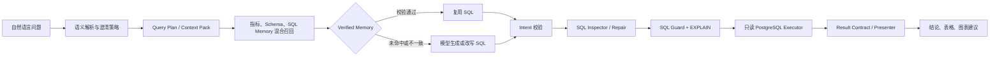

# 电商数据智能分析 Agent

> 面向业务人员的自然语言数据分析系统：把一句业务问题转成可验证、可追踪、只读执行的 SQL，并返回结论、结果表和可视化建议。

[](backend/)
[](frontend/)
[](docs/data_model.md)

## 项目价值

传统 NL2SQL 方案容易出现“字段找错、口径不一致、SQL 不安全、结果无法解释”。本项目将语义契约、混合检索、SQL Memory、模型生成、SQL Inspector、Guard 和只读执行串成一条可观测链路，重点解决电商场景中的指标口径、跨表关联和历史 SQL 复用问题。

**适合作为简历项目的核心概括：** 独立完成一个从自然语言问题到安全 SQL 执行和结果呈现的端到端数据分析 Agent，并用结构化评测验证准确率与记忆复用收益。

## 量化结果

指标来自仓库内已落盘的 20 条结构化真实评测和 SQL Memory 冷热对照报告，报告路径可直接复核。

| 指标 | 结果 | 说明 |
| --- | ---: | --- |
| SQL 执行成功率 | **20/20（100%）** | 复杂语义合同最终评测，包含生成、校验、Guard、EXPLAIN 和只读执行 |
| 结构化结果行匹配率 | **15/20（75%）** | 相比前一轮 12/20（60%）提升 **15 个百分点** |
| 默认标准评测严格成功率 | **95%（19/20）** | 标准问题集的端到端严格结果 |
| SQL Memory 热链路平均耗时 | **13.86s** | 同三条问题冷链路 29.08s，平均降低 **52.36%** |
| 数据库执行耗时 | **约 0.28s** | 端到端瓶颈主要在模型生成与语义上下文，而非数据库执行 |

> 评测报告：[`sql_accuracy_20_complex_contracts_final_20260722.json`](eval/reports/sql_accuracy_20_complex_contracts_final_20260722.json)、[`sql_memory_warmup_final_comparison_20260722.json`](eval/reports/sql_memory_warmup_final_comparison_20260722.json)。以上是当前阶段结果，不将 75% 行匹配率表述为已经达标。

## 技术架构



### 关键设计

- **语义层**：版本化 Semantic Contract 和 Resolver 统一指标、实体、维度、时间粒度与业务口径；信息不足时才澄清。
- **召回层**：指标定义、schema 字段、真实外键关系和 SQL Memory 采用关键词、结构化规则与 pgvector 的混合检索，并对上下文做压缩。
- **生成层**：Query Plan 固化可执行约束，模型只消费受控 Context Pack；历史 SQL 只能作为经过校验的候选或改写参考。
- **安全层**：所有 SQL 必须经过意图校验、SQL Inspector、SQL Guard、EXPLAIN 和只读 Executor；模型不能直接访问数据库，也不能绕过安全边界。
- **记忆层**：成功查询沉淀为 candidate/executed/reviewed/verified 状态，只有 verified SQL 满足当前问题合同才进入 `fast_path`。
- **可观测层**：`query_runs`、`tool_calls` 和开发者 API 记录路由、召回、修复和耗时摘要，便于按失败类型定位问题。

## 产品能力

- 聊天式电商数据问答：支持销售额、订单、用户、商品、品类、支付等多表分析。
- 自动生成结论、结果表和可视化建议；长 SQL 支持折叠、复制和滚动查看。
- 指标口径 CRUD、schema metadata 同步、embedding 批量刷新和 SQL Memory 管理。
- 失败可诊断：区分召回缺失、指标口径冲突、字段错误、GROUP BY、类型转换、语法和运行时错误。
- 前后端均提供清晰 API 契约，支持开发者查看 run 详情与工具调用摘要。

## 项目结构

```text
frontend/   React + Vite + TypeScript 用户界面
backend/    FastAPI、LangGraph Agent、检索、SQL 校验与 PostgreSQL 访问
eval/       标准问题集、数据库真值集、评测脚本与报告
docs/       架构、API、安全边界、计划和模块交付记录
```

## 快速开始

### 环境要求

- Python 3.12（项目使用 `.venv`）
- Node.js / npm
- PostgreSQL（可选 pgvector）
- OpenAI-compatible 模型服务；本地默认可接 Ollama

真实连接串和模型密钥只写入 `backend/.env`，不要提交到 Git。配置模板和数据库初始化说明见 [本地环境与常用命令](docs/architecture.md)。

### 启动

```bash
# 安装前端依赖
npm --prefix frontend install

# 初始化数据库与检索上下文
.venv\Scripts\python backend/scripts/init_db.py
npm run context:refresh

# 启动后端与前端（分别执行）
npm run backend:dev
npm run frontend:dev
```

启动后访问 Vite 输出的本地地址，后端 API 默认位于 `http://127.0.0.1:8000`。

## 评测与验证

```bash
npm run backend:test
npm run frontend:build
npm run eval:standard
npm run eval:database-baseline
```

标准评测报告会写入 `eval/reports/latest_eval_report.json`。真实数据库真值评测需要在本地配置认证账号；每个 case 会记录 `run_id` 和运行路径，便于从结果追踪到召回、生成、修复或执行阶段。

## 文档导航

- [系统架构](docs/architecture.md) · [Agent 工作流](docs/agent_workflow.md)
- [数据模型](docs/data_model.md) · [API 文档](docs/api.md)
- [SQL Guard 与只读执行](docs/sql_guard.md) · [SQL Memory](docs/sql_memory.md)
- [评测说明](docs/evaluation.md) · [API 文档索引](docs/api_index.md)
- [复杂 SQL 质量改进记录](docs/modules/2026-07-22-complex-sql-generation-quality.md)
- [SQL Memory 冷热链路评测](docs/modules/2026-07-22-sql-memory-warmup-evaluation.md)

## 当前边界与后续方向

当前系统已具备完整的安全执行和可观测链路，但复杂问题的结果语义仍有提升空间。下一步聚焦失败归因驱动的召回增强、指标元数据补全、Inspector 定向 Repair，以及更大规模的结构化真值评测。
