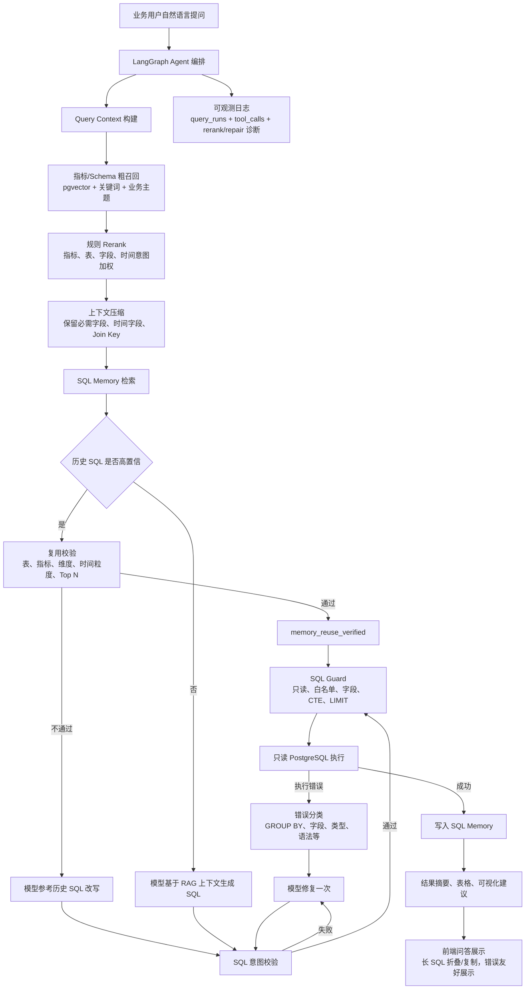

# 本地数据分析 Agent

本项目是一个面向业务分析人员的本地化 AI 数据分析系统。用户可以像聊天一样提出业务问题，系统后端负责召回指标口径和表结构、生成或复用 SQL、通过 SQL Validator / SQL Guard、执行只读 PostgreSQL 查询，并返回自然语言结论、最终 SQL、结果表和数据来源。

普通用户界面聚焦可信分析结果；模型、数据库连接状态、SQL Memory 评分、工具调用 payload 和评估报告等调试信息默认不展示给业务用户。

## 项目亮点

- **Agentic NL2SQL 编排**：使用 LangGraph 将问题理解、RAG 召回、SQL Memory、模型生成、校验修复、只读执行和结果呈现拆成可观测节点。
- **面向电商指标的 RAG 链路**：融合指标定义、schema 字段、表关系、向量召回、规则 rerank 和上下文压缩，降低字段幻觉和表误选风险。
- **SQL Memory + Agent 记忆雏形**：沉淀历史成功问题、SQL、结果列和执行状态，高置信候选必须通过当前问题校验后才可复用。
- **SQL 安全与自动修复闭环**：模型 SQL 必须经过意图校验、SQL Guard 和只读执行；数据库执行错误会分类后回传模型修复一次。
- **产品化问答体验**：前端按摘要、SQL、结果表和错误卡片分层展示，长 SQL 支持折叠、换行、滚动和一键复制。

## 业务流程图



## 当前能力

- 聊天式数据问答：`POST /api/analyze` 已接入真实 PostgreSQL 查询链路。
- 指标口径 CRUD：`GET/POST/PUT/DELETE /api/metrics` 已持久化到 `metric_definitions`。
- Schema + Metric Retriever：从 `schema_metadata` 和 `metric_definitions` 召回分析上下文，已接入文本分数 + pgvector 语义候选的混合检索；向量不可用时自动退回文本检索；用户、流量、优惠券等业务主题会补充召回相关表字段。
- RAG Rerank 与上下文压缩：粗召回后会基于指标、表、字段、时间意图进行规则重排，压缩 schema 上下文时优先保留指标必需字段、时间字段和 join key，并把 rerank 诊断写入开发者日志。
- Schema Metadata 自动同步：可从当前 PostgreSQL `information_schema` 刷新 `schema_metadata`，支持换库、换表后的字段上下文更新；新增字段会按字段名生成基础中文说明，已有人工说明不会被覆盖。
- 数据上下文刷新命令：`npm run context:refresh` 会先同步 `schema_metadata`，再同步 schema、metric、SQL Memory embedding，用于换库、换表后的检索资产刷新。
- 统一 ModelAdapter 基础层：已提供 OpenAI-compatible chat completions 适配器、模型配置、超时、重试和结构化错误，后续 SQL Generator 必须通过该入口调用模型。
- LangGraph 正式编排：`/api/analyze` 主链路已由 LangGraph `StateGraph` 编排，串起上下文召回、SQL Memory、SQL 生成、SQL Guard、只读执行、结果呈现和运行日志。
- Model-backed SQL Generator 基础工具：已能基于召回到的 schema/metric 构造受控 prompt payload、调用 ModelAdapter、解析模型 JSON SQL；已通过开关接入 `/api/analyze` 主链路。
- Schema 表关系上下文：`RetrievalContext` 会优先读取 PostgreSQL 真实外键，并用字段命名规则兜底生成 join hints，提供给模型 SQL 生成 prompt，减少跨表问题对固定模板的依赖。
- Model SQL Generator 接入：`/api/analyze` 已具备模型优先 SQL 生成入口；本地默认接入 Ollama `qwen2.5-coder:3b`，固定模板生成路径已移除，最终 SQL 仍必经 Guard 和只读 Executor。
- SQL 上下文表覆盖检查：当已召回的非默认业务表没有进入最终 SQL 时，后端会写入开发者诊断；若模型 SQL 生成已开启，会优先尝试用召回上下文重新生成 SQL，普通用户界面不展示该调试细节。
- SQL 安全链路：SQL Validator + SQL Guard 拦截写操作、多语句、非白名单表、不存在字段和 `SELECT *`。
- 只读 SQL Executor：仅执行 Guard 放行后的 SELECT，并返回标准化 JSON 行数据。
- Query Run Logging：每次 analyze 会写入 `query_runs`，关键工具调用写入 `tool_calls`。
- SQL Memory：成功查询会写入 `sql_memories` 并同步 question/sql embedding；`fast_path` 只表示高置信候选，必须通过指标、维度、表覆盖、时间粒度和 Top N 校验后才会以 `memory_reuse_verified` 执行。
- SQL 生成路径：固定模板运行时路径已移除；未通过复用校验或无候选时，由模型基于召回 schema、指标口径、历史 SQL 参考和表关系上下文生成或改写 SQL；模型 SQL 还会经过意图校验，失败时自动修复一次。
- SQL 执行错误修复闭环：数据库执行失败会被分类为 `group_by`、`missing_column`、`missing_table`、`type_cast`、`division_by_zero`、`syntax` 或 `runtime`，并带着错误类别、原 SQL 和业务化摘要回传模型修复一次，修复后仍必须重新通过意图校验与 SQL Guard。
- SQL Guard 增强：支持 CTE / 派生表输出列校验，同时继续拦截写操作、多语句、非白名单真实表、不存在字段和 `SELECT *`。
- 前端统一 API Client：数据问答和指标 CRUD 已统一通过 `frontend/src/api/client.ts` 调用后端，支持 FastAPI `detail` 解析和中文错误提示。
- 前端问答展示优化：长 SQL 支持折叠/展开、自动换行、滚动和复制反馈；分析结果按摘要、自然语言分析、SQL 和结果表分层展示，接口或执行失败时展示业务友好的错误卡片。
- 通用结果表：`/api/analyze.rows` 已改为 SQL 执行结果的通用表格结构，前端聊天页会动态生成表头，减少对固定销售趋势字段的依赖。
- 通用结果总结：Presenter 会根据 SQL 返回列动态识别维度列、数值列和比例列，生成中文摘要和指标卡，减少对固定销售趋势字段的依赖。
- 前端接口契约补齐：`AnalysisResponse` 已声明后端返回的 `trace` 和 `steps`，但普通用户页面不展示内部调试细节。
- 统一检索评分基础层：metric、schema、SQL Memory 检索已复用文本相似、关键词命中、集合重合和加权评分工具，为后续 embedding / pgvector 混合检索打基础。
- EmbeddingAdapter 基础层：已提供 OpenAI-compatible embeddings 统一入口和 deterministic 本地 fallback，后续 schema、metric、SQL Memory 向量化必须通过该入口。
- Schema / Metric / SQL Memory Embedding 同步：可运行脚本把 `schema_metadata.embedding`、`metric_definitions.embedding` 和旧 `sql_memories` 的 question/sql embedding 写入 pgvector 字段，支持 `--limit` 小批量验证和 `--batch-size` 批量请求，为后续混合检索准备向量资产。
- pgvector 混合检索：metric/schema retriever 会用 `EmbeddingAdapter` 生成问题向量，并结合 pgvector 候选分与原有关键词、文本和结构化分数排序。
- SQL Memory 混合检索：`semantic_similarity` 已优先使用 `sql_memories.question_embedding` 的 pgvector 分数，向量不可用时回退文本相似。
- 开发者调试 API：`GET /api/runs`、`GET /api/runs/{run_id}` 可查看运行记录和工具调用摘要。
- SQL Memory 调试 API：`GET /api/memories`、`GET /api/memories/{memory_id}` 可查看历史成功 SQL。
- 标准问题评估：`npm run eval:standard` 可运行 20 个 V1 标准问题，并生成 `eval/reports/latest_eval_report.json`；报告中的每个 case 会带 `run_id`、`run_detail_path` 和 `run_trace_summary`，便于开发者从失败项追到 `/api/runs/{run_id}` 并快速判断召回或生成问题。

## 项目结构

```text
frontend/   React + Vite + TypeScript 前端
backend/    FastAPI 后端、Agent 编排、工具函数、PostgreSQL 访问
docs/       计划文档、模块完成说明、handoff、数据库说明
eval/       标准问题评估集、评估脚本和最新报告
```

## V1 核心文档

- [架构说明](docs/architecture.md)
- [数据模型说明](docs/data_model.md)
- [Agent 工作流说明](docs/agent_workflow.md)
- [接口文档索引与阅读顺序](docs/api_index.md)
- [V1 接口文档](docs/api.md)
- [前后端接口映射文档](docs/api_frontend_mapping.md)
- [接口错误码与权限边界文档](docs/api_error_auth.md)
- [接口变更流程与版本维护文档](docs/api_change_process.md)
- [接口联调与 Smoke 示例文档](docs/api_smoke_examples.md)
- [SQL Guard 与只读执行说明](docs/sql_guard.md)
- [SQL Memory 机制说明](docs/sql_memory.md)
- [标准问题评估说明](docs/evaluation.md)

## 本地环境

后端依赖 PostgreSQL。项目后端运行在本地 Python 3.12 虚拟环境 `.venv` 中，避免系统默认 Python 3.15 beta 下部分 LangGraph 原生依赖无法构建；`npm run backend:*`、`npm run eval:standard` 和 `npm run context:refresh` 已默认使用 `.venv\Scripts\python`。

本机当前使用：

```text
host: 127.0.0.1
port: 5432
database: local_data_agent
user: postgres
schema: public
```

本地真实密码只写在 `backend/.env`，不要提交到 Git。示例：

```env
DATABASE_URL=postgresql://postgres:<password>@127.0.0.1:5432/local_data_agent
MODEL_PROVIDER=local
MODEL_BASE_URL=http://127.0.0.1:11434/v1
MODEL_NAME=qwen2.5-coder:3b
MODEL_API_KEY=change_me
MODEL_SQL_GENERATOR_ENABLED=true
EMBEDDING_PROVIDER=aliyun
EMBEDDING_BASE_URL=https://dashscope.aliyuncs.com/compatible-mode/v1
EMBEDDING_MODEL=text-embedding-v4
EMBEDDING_API_KEY=<dashscope-api-key>
EMBEDDING_DIMENSIONS=1536
```

`MODEL_API_KEY=change_me` 是 Ollama 本地占位值，不会被 ModelAdapter 写入 Authorization header。阿里云 DashScope 真实密钥写入 `EMBEDDING_API_KEY`，或使用 `DASHSCOPE_API_KEY` / `ALIYUN_API_KEY` 环境变量；真实密钥只放在本机 `backend/.env`，不要提交。

## 常用命令

```bash
npm run backend:test
npm run eval:standard
npm run context:refresh
npm run test:e2e
npm run frontend:build
npm run backend:dev
npm run frontend:dev
.venv\Scripts\python backend/scripts/init_db.py
.venv\Scripts\python backend/scripts/sync_schema_metadata.py
.venv\Scripts\python backend/scripts/sync_embeddings.py
.venv\Scripts\python backend/scripts/sync_embeddings.py --target memory --limit 20
.venv\Scripts\python backend/scripts/sync_embeddings.py --target schema --limit 100 --batch-size 16
.venv\Scripts\python backend/scripts/sync_embeddings.py --target schema --limit 100 --batch-size 16 --sleep-ms 200
.venv\Scripts\python backend/scripts/refresh_context.py
.venv\Scripts\python backend/scripts/refresh_context.py --embedding-limit 20
.venv\Scripts\python backend/scripts/refresh_context.py --embedding-limit 100 --embedding-batch-size 16
.venv\Scripts\python backend/scripts/refresh_context.py --embedding-limit 100 --embedding-batch-size 16 --embedding-sleep-ms 200
```

换库、导入新表或调整字段后，先运行：

```bash
.venv\Scripts\python backend/scripts/init_db.py
.venv\Scripts\python backend/scripts/sync_schema_metadata.py
.venv\Scripts\python backend/scripts/sync_embeddings.py
```

也可以直接运行统一刷新命令：

```bash
npm run context:refresh
```

`sync_schema_metadata.py` 会扫描当前 PostgreSQL `public` schema 中的业务表字段，更新 `schema_metadata`，为新增或空说明字段生成基础中文业务含义，并保留已有人工字段说明。可用 `--refresh-generated-descriptions` 显式刷新早期系统生成的泛化说明，人工说明不会被覆盖。`sync_embeddings.py` 会为 schema 字段、指标口径和缺少向量的历史 SQL Memory 生成 embedding 并写入 pgvector 字段；默认本地配置使用 deterministic fallback，真实语义检索质量需要配置可用的 embedding provider。可用 `--limit 20` 限制每个目标本次最多同步的记录数，适合先小批量验证；可用 `--batch-size 16` 控制每次 embedding 请求包含的记录数；可用 `--sleep-ms 200` 在连续请求之间等待，降低真实 provider 限流风险。批量请求失败时会默认退回单条重试，尽量只把真正失败的记录写入错误摘要。`refresh_context.py` 会先同步 schema metadata，再按需同步 embedding；可用 `--skip-embeddings` 只刷新字段结构，也可用 `--refresh-generated-descriptions` 升级旧泛化字段说明，也可重复传入 `--embedding-target schema|metric|memory` 选择同步目标，或用 `--embedding-limit 20` / `--embedding-batch-size 16` / `--embedding-sleep-ms 200` 控制本次 embedding 同步规模、请求批次和请求间隔。

## API 入口

接口文档阅读顺序见 [接口文档索引与阅读顺序](docs/api_index.md)。完整字段说明、请求示例、响应结构和错误边界见 [V1 接口文档](docs/api.md)。前端 API client 与后端接口字段关系见 [前后端接口映射文档](docs/api_frontend_mapping.md)。错误码、权限边界和上线前鉴权建议见 [接口错误码与权限边界文档](docs/api_error_auth.md)。接口字段、路径或权限发生变化时，按 [接口变更流程与版本维护文档](docs/api_change_process.md) 同步。手工联调命令和 smoke 检查点见 [接口联调与 Smoke 示例文档](docs/api_smoke_examples.md)。

- `GET /api/health`：服务健康检查。
- `POST /api/analyze`：聊天式数据问答。
- `GET /api/metrics`：指标口径列表。
- `POST /api/metrics`：创建指标口径。
- `PUT /api/metrics/{metric_id}`：更新指标口径。
- `DELETE /api/metrics/{metric_id}`：删除指标口径。
- `GET /api/runs`：开发者查看最近运行记录。
- `GET /api/runs/{run_id}`：开发者查看单次运行及工具调用。
- `GET /api/memories`：开发者查看 SQL Memory 列表。
- `GET /api/memories/{memory_id}`：开发者查看单条 SQL Memory。

## SQL Memory 当前说明

当前 SQL Memory 是“候选召回 + 校验后复用”机制：

- `fast_path`、`rewrite_path`、`cold_path` 是复用规划和观测标签，不再代表三套独立 SQL 生成实现。
- `fast_path` 只会进入 `verify_memory_sql`；候选 SQL 同时满足当前问题的关键表、指标 token、维度 token、时间粒度、Top N / LIMIT 约束后，才会输出 `memory_reuse_verified` 并进入 Guard。
- 校验失败的候选会降级为 `rewrite_path`，历史 SQL 作为模型改写参考，不会直接执行。
- `rewrite_path` 和 `cold_path` 都通过 `backend/app/tools/model_sql_generator.py` 走模型生成或改写。
- 成功查询会把最终 SQL、结果列、行数、生成路径、模型信息和相关上下文写入 `sql_memories`。
- 成功查询会同步 `question_embedding` 和 `sql_embedding`；检索时用问题向量召回历史 memory 候选。
- 普通用户不默认看到 SQL Memory 候选分数；开发者通过 `/api/memories` 和 `/api/runs` 查看。

## Model-backed SQL Generator 当前说明

- 模型调用统一通过 `backend/app/core/model_adapter.py`。
- embedding 调用统一通过 `backend/app/core/embedding_adapter.py`。
- schema/metric/SQL Memory 向量同步通过 `backend/app/services/embedding_sync_service.py` 和 `backend/scripts/sync_embeddings.py` 执行，支持 `--limit` 控制本次同步规模，支持 `--batch-size` 降低真实 provider 请求次数，支持 `--sleep-ms` 做固定间隔限速。
- schema/metric/SQL Memory 混合检索通过 `backend/app/tools/vector_retrieval.py` 查询 pgvector 候选；失败时自动退回原文本检索。
- SQL 生成 prompt 由 `backend/app/tools/model_sql_generator.py` 构造，只包含召回到的 schema 字段、指标口径、复用计划、可选历史 SQL 参考和表关系上下文；表关系优先来自 PostgreSQL 外键，没有外键时再使用字段命名推断，不使用全量数据库结构。
- SQL 生成 prompt payload 已通过结构化测试覆盖；模型返回编造字段时仍会被 SQL Validator / SQL Guard 在执行前拦截。
- 模型响应要求为 JSON，解析后输出 `GeneratedSql`。
- 模型生成的 SQL 已接入 `/api/analyze`，但仍必须经过 SQL Validator、SQL Guard 和只读 Executor。
- `/api/analyze` 使用 `MODEL_SQL_GENERATOR_ENABLED` 开关控制模型 SQL 生成；本地默认 `true`，`rewrite_path` 与 `cold_path` 会走模型，`fast_path` 只有校验通过才会复用历史 SQL。
- 运行时固定 SQL 模板已删除；模型失败或未返回 SQL 时返回 `model_error`，不会用硬编码模板兜底。
- 普通用户前端不展示 prompt、模型原始输出、provider 或模型连接状态。
- 普通用户前端也不展示 embedding provider、向量状态或数据库连接状态。

## 标准问题评估

```bash
npm run eval:standard
```

评估数据集位于 `eval/datasets/standard_questions.jsonl`，当前包含 20 个 V1 标准问题。报告输出到 `eval/reports/latest_eval_report.json`，包含执行成功率、严格成功率、SQL 生成成功率、表命中率、关键词命中率、记忆命中率、复用成功率、平均延迟、路径占比、执行失败案例、断言失败案例，以及每个 case 对应的 `run_id` / `run_detail_path` / `run_trace_summary`。

当前评估区分两层结果：

- `execution_success_rate`：API 链路是否成功返回 SQL、通过 SQL Guard、得到结果。
- `strict_success_rate`：在链路成功基础上，SQL 是否命中预期表和关键词。

最近一次后端模块回归为 `157 passed, 1 warning`。SQL Memory fast 候选已加入执行前复用校验，避免仅凭相似度直接复用历史 SQL；未通过校验的候选会转为模型改写。

## 下一步建议

当前主链路已经从“固定模板 + 直接 fast 复用”升级为“LangGraph 编排 + RAG rerank + verified memory + model-first SQL 生成 + SQL 意图校验/自动修复 + 执行错误修复闭环”。下一步建议进入 **评估驱动的失败归因**：

1. **P0：评估驱动的失败归因**
   - 扩展 `eval/datasets/standard_questions.jsonl`，覆盖更多真实业务问法、同义词、时间范围、跨表 join、空结果和 Top N 场景。
   - 在评估报告中按失败类型聚合：召回缺表、指标缺失、模型字段编造、Guard 拦截、执行错误修复失败、结果为空、SQL 与问题不一致。
   - 用失败归因决定优化检索、prompt、metadata 还是 Guard，而不是凭感觉补 case。

2. **P1：补强元数据与指标口径**
   - 补齐 `metric_definitions` 的同义词、公式、必需表字段和业务解释，让模型生成更依赖可维护口径。
   - 持续刷新 `schema_metadata` 字段业务含义和 embedding，尤其是换库、换表、新增字段之后。
   - 对关键跨表关系补真实外键或人工关系说明，减少模型 join 猜测。

3. **P2：生产可观测与体验**
   - 在 `/api/runs/{run_id}` 中展示意图校验结果、修复次数、最终选择原因。
   - 给普通用户返回更明确的失败解释，例如“缺少毛利成本字段”或“生成 SQL 未覆盖复购率口径”。
   - 对 Ollama 和 embedding provider 增加健康检查、超时指标和慢查询告警。

## 当前验证

最近一次模块验证通过：

```bash
npm run frontend:build
npm run backend:test
npm run test:e2e
npm run eval:standard
```

本轮验证结果：`npm run frontend:build` 通过，`npm run backend:test` 为 `157 passed, 1 warning`，`npm run test:e2e` 通过。`npm run eval:standard` 未在本轮重复执行。

## 开发约定

- 每次继续开发前先读取 `docs/handoff/current.md`。
- 每个模块先写 `docs/plans/YYYY-MM-DD-module-name.md`。
- 模块完成后写 `docs/modules/YYYY-MM-DD-module-name.md`。
- 通过相关测试后再提交并推送到 GitHub。
- 普通用户前端不默认展示模型、数据库连接、SQL 记忆评分、工具调用原始日志和评估报告。
