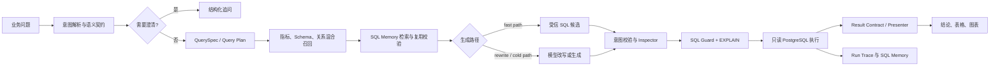

# 电商数据智能分析 Agent

> 用自然语言查询本地业务数据库，将问题转换为经过语义约束、安全校验和只读执行的 SQL，并返回结论、表格与图表。

[](backend/)
[](backend/app/main.py)
[](frontend/)
[](docs/data_model.md)
[](backend/app/agents/analysis_graph.py)

## 项目简介

这是一个面向业务分析场景的全栈 Text-to-SQL Agent。用户可以直接提问“最近 30 天销售额趋势如何”或“哪些品类的毛利率最高”，系统会理解指标和维度、召回相关 Schema 与指标口径、生成或复用 SQL，并在执行前完成多层安全检查。

项目关注的不只是“让模型写出 SQL”，而是让一次数据分析具备四个工程属性：

- **口径一致**：用版本化语义契约、QuerySpec 和 Query Plan 约束指标、维度、过滤条件与聚合粒度。
- **执行安全**：所有生成或复用的 SQL 都必须经过 Inspector、Validator、Guard、`EXPLAIN` 和只读事务。
- **结果可追踪**：每次分析保留召回、生成、修复、执行和耗时摘要，可从评测结果定位到具体 Run Trace。
- **能力可评估**：仓库内置标准问题集、数据库真值集、结构化断言和失败归因报告，不以“能返回 SQL”代替准确性验证。

## 核心能力

| 能力 | 实现方式 |
| --- | --- |
| 自然语言数据问答 | 支持销售、订单、用户、商品、支付、退款、流量和优惠券等跨表分析 |
| 语义理解与澄清 | 专用意图模型 + 本地规则兜底；只有缺少必要槽位或存在契约冲突时才追问 |
| 混合上下文召回 | 融合关键词、业务规则、pgvector 向量检索、指标元数据、Schema 字段和 PostgreSQL 外键 |
| SQL 生成与修复 | OpenAI-compatible 模型按 Query Plan 生成或改写 SQL；校验失败和部分执行错误可进入一次受控 Repair |
| Trusted SQL Memory | 历史 SQL 按生命周期管理；只有满足当前语义合同的 verified 记录才可尝试快速复用 |
| SQL 安全防线 | 拦截写操作、多语句、未知表字段、`SELECT *`、危险函数和超限结果，并在只读事务中执行 |
| 分析结果展示 | React 聊天工作台展示业务结论、指标、结果表、ECharts 图表、SQL 与可信说明 |
| 运行与评测诊断 | 记录节点耗时、模型路由、上下文表覆盖、Guard 结果和 Repair 次数，支持按失败类型回归 |

## 工作原理


```mermaid
flowchart LR
    A[业务问题] --> B[意图解析与语义契约]
    B --> C{需要澄清?}
    C -->|是| D[结构化追问]
    C -->|否| E[QuerySpec / Query Plan]
    E --> F[指标、Schema、关系混合召回]
    F --> G[SQL Memory 检索与复用校验]
    G --> H{生成路径}
    H -->|fast path| I[受信 SQL 候选]
    H -->|rewrite / cold path| J[模型改写或生成]
    I --> K[意图校验与 Inspector]
    J --> K
    K --> L[SQL Guard + EXPLAIN]
    L --> M[只读 PostgreSQL 执行]
    M --> N[Result Contract / Presenter]
    N --> O[结论、表格、图表]
    M --> P[Run Trace 与 SQL Memory]
```

这里最重要的边界是：**LLM 只负责产生候选意图或候选 SQL，不能直接访问数据库，也不能跳过确定性校验链路。**

## 技术栈

- **前端**：React 19、TypeScript、Vite、TanStack Query、TanStack Virtual、ECharts、Tailwind CSS
- **后端**：FastAPI、Pydantic、LangGraph、SQLGlot、pg8000
- **数据与检索**：PostgreSQL、pgvector、Redis（会话加速与回退）
- **模型接入**：OpenAI-compatible API，可分别配置意图识别、SQL 生成、通用对话与 Embedding 模型
- **质量保障**：Pytest、结构化 JSONL 评测集、数据库真值对照、Run Trace 失败归因

## 产品界面

当前前端提供：

- 聊天式分析工作台与流式响应
- 会话历史、分页加载和上下文压缩
- 数据源、指标口径、个人资料与模型设置页面
- 结论、指标卡、数据表、图表、SQL 和可信说明的组合展示
- 管理员可通过后端 API 查看 SQL Memory 与查询运行详情

## 项目结构

```text
.
├─ frontend/                  # React 用户界面、页面、组件与 API Client
├─ backend/
│  ├─ app/api/                # FastAPI 薄路由
│  ├─ app/services/           # 应用服务与业务编排
│  ├─ app/agents/             # LangGraph 分析链路
│  ├─ app/tools/              # 检索、计划、SQL、Guard、执行与 Presenter
│  ├─ app/core/               # 配置、模型和 Embedding 适配器
│  ├─ app/db/                 # PostgreSQL 仓储与迁移
│  └─ tests/                  # 后端测试与 API Smoke
├─ eval/                      # 数据集、评测脚本与最新报告
├─ docs/                      # 架构、API、安全、评测和研发记录
└─ package.json               # 工作区常用命令
```

更完整的模块职责见 [项目结构说明](docs/project-structure.md)。

## 快速开始

### 1. 环境准备

- Python 3.12
- Node.js 与 npm
- PostgreSQL，并安装 pgvector 扩展
- 一个 OpenAI-compatible 模型服务，例如 Ollama 或云端兼容接口

### 2. 安装依赖

```powershell
py -3.12 -m venv .venv
.venv\Scripts\python -m pip install -r backend\requirements.txt
npm --prefix frontend install
```

### 3. 配置环境

```powershell
Copy-Item backend\.env.example backend\.env
```

至少需要检查 `DATABASE_URL`、`MODEL_*`、`INTENT_MODEL_*` 和 `EMBEDDING_*`。密钥与真实连接串只应保存在 Git 忽略的 `backend/.env` 中。

### 4. 初始化数据库与上下文

```powershell
.venv\Scripts\python backend\scripts\init_db.py
npm run context:refresh
```

### 5. 启动服务

分别打开两个终端：

```powershell
npm run backend:dev
```

```powershell
npm run frontend:dev
```

前端默认地址为 `http://127.0.0.1:3000`，后端 API 默认地址为 `http://127.0.0.1:8000`，健康检查为 `GET /api/health`。

## 验证与评测

```powershell
# 后端测试
npm run backend:test

# 前端生产构建
npm run frontend:build

# API 全链路 Smoke
npm run test:e2e

# 标准 20 题快速回归
npm run eval:standard

# 需要本地认证与真实数据库的真值评测
npm run eval:database-baseline
```

最新标准评测会写入 [`eval/reports/latest_eval_report.json`](eval/reports/latest_eval_report.json)。报告记录 SQL 生成与执行状态、表和关键词断言、语义结果检查、性能摘要，以及关联的 `run_id` 和 Run Trace 摘要。

评测结果受数据版本、模型配置和本机环境影响，因此 README 不把单次阶段性百分比当作固定产品指标。复现结果时请同时记录所用数据集、模型和报告时间。

## 安全设计

- 只允许单条只读查询，拒绝 DDL、DML、多语句和危险数据库函数。
- 对真实表、字段、CTE、派生列和结果行数执行白名单校验。
- 在执行前运行 SQL 意图校验、Inspector、Guard 和 `EXPLAIN`。
- 使用只读事务，并设置 statement timeout 与 lock timeout。
- 日志和 Run Trace 不记录 API Key、完整 Prompt 或原始内部错误。
- 普通用户界面只展示业务结果；模型路由、Memory 分数和工具 payload 留在开发者诊断入口。

详细边界见 [SQL Guard](docs/sql_guard.md) 和 [Agent 工作流](docs/agent_workflow.md)。

## 文档

- [系统架构](docs/architecture.md)
- [Agent 工作流](docs/agent_workflow.md)
- [数据模型](docs/data_model.md)
- [API 文档](docs/api.md)
- [评测说明](docs/evaluation.md)
- [SQL Memory](docs/sql_memory.md)
- [项目结构](docs/project-structure.md)

## 当前状态

项目已完成从聊天界面、语义规划、混合召回、模型 SQL 生成、安全执行到结果呈现和评测追踪的端到端闭环。当前迭代重点是提升换库换表后的通用 SQL 生成质量、减少已召回但未被 SQL 使用的关键表，并完善复杂聚合与跨表口径的结构化真值评测。

本项目目前以本地开发和技术验证为目标，尚未提供生产部署模板。
