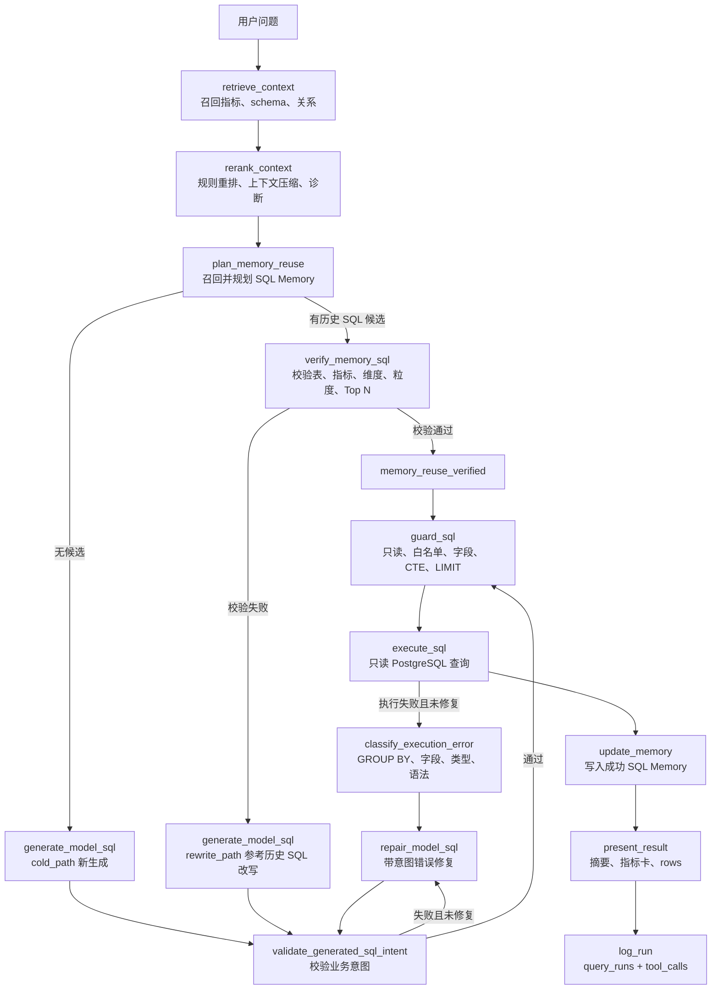

# Agent 工作流说明

## API 入口

用户通过：

```http
POST /api/analyze
```

请求体：

```json
{"question":"最近 30 天销售额按天变化如何？"}
```

返回 `AnalyzeResponse`，包含：

- `summary`
- `sql`
- `metrics`
- `rows`
- `source`
- `trace`
- `steps`

## 当前工作流

`backend/app/agents/analysis_graph.py` 是 V1 主链路，当前使用 LangGraph `StateGraph` 编排正式节点流转。

1. 读取用户问题。
   - 意图解析会构建 `QuerySpec`，明确指标、维度、时间、排序、必需表组、输出 token 和禁止口径。
2. `build_retrieval_context()` 召回指标口径和 schema：
   - metric/schema retriever 先用 `EmbeddingAdapter` 生成问题向量。
   - pgvector 候选分与关键词、文本相似度、必需表字段等规则分融合排序。
   - 对用户、流量、优惠券、退款、毛利、商品等业务主题，会补充召回相关表字段，避免后续生成阶段缺少真实 schema。
   - 粗召回后进入规则 rerank：基于指标、表、字段和时间意图重新排序 metric/schema 候选。
   - schema 上下文会做轻量压缩，优先保留指标必需字段、时间字段和 join key，减少 prompt 冗余。
   - rerank 诊断会写入开发者 `tool_calls`，普通用户页面不展示内部评分。
   - embedding 或 pgvector 不可用时自动退回原文本检索，不中断分析。
   - 后端会优先从 PostgreSQL 真实外键读取 `table_relationships`，并在没有外键时基于已召回字段命名推断关系，例如 `orders.id = payments.order_id`，供模型 SQL 生成参考。
3. `retrieve_sql_memory()` 检索历史成功 SQL：
   - 优先使用 `sql_memories.question_embedding` 的 pgvector 候选分作为 `semantic_similarity`。
   - 再融合文本相似、表/指标匹配和历史成功率。
   - 向量不可用或旧 memory 没有 embedding 时回退文本相似。
4. `plan_sql_reuse()` 决定 `fast_path`、`rewrite_path` 或 `cold_path`。
5. 如果存在历史 SQL 候选，先进入 `verify_memory_sql()`：
   - 校验候选 SQL 是否覆盖当前召回的关键表。
   - 校验当前问题所需指标 token、维度 token、时间粒度、Top N / LIMIT 是否匹配。
   - 只有校验通过的 `fast_path` 候选会输出 `memory_reuse_verified`，继续进入 Guard。
   - 校验失败的候选会降级为 `rewrite_path`，历史 SQL 仅作为模型改写参考。
   - SQL Memory 检索、复用校验和成功写入都使用当前 `QuerySpec`；写入时只保存最终 SQL 实际使用的表和语义维度。
6. `generate_model_sql()` 负责模型生成或模型改写：
   - `rewrite_path` 会把历史 SQL 参考放入 prompt payload。
   - `cold_path` 基于召回字段、指标口径和表关系上下文重新生成。
   - prompt 会包含 `QuerySpec`，要求 SQL 覆盖对应表组、输出指标/维度 token，并规避已知错误口径。
   - 运行时固定 SQL 模板已移除；模型失败或无 SQL 时返回 `model_error`，不再硬编码兜底。
7. `validate_generated_sql_intent()` 校验模型 SQL 是否回答当前问题：
   - 基于 `QuerySpec` 校验明确要求的关键表、指标 token、维度 token、时间粒度和 Top N / LIMIT。
   - 校验失败时进入 `repair_model_sql()`，带着原 SQL、错误列表和上下文让模型修复一次。
   - 修复后仍失败会转为 `model_error`，不会继续执行。
8. `guard_sql()` 做 SQL 安全拦截；即使 SQL 来自模型或已验证 memory，也会经过字段存在性、CTE / 派生列、只读、白名单真实表、`SELECT *` 和 LIMIT 等校验。
9. `execute_guarded_sql()` 在显式只读事务中执行，并设置 statement/lock timeout；Guard 会强制收紧 LIMIT 并拦截危险数据库函数。
10. 如果数据库执行失败，执行器会分类错误：
   - `group_by`：聚合字段没有正确进入 `GROUP BY`。
   - `missing_column` / `missing_table`：模型使用了不存在的字段或表。
   - `type_cast` / `division_by_zero` / `syntax` / `runtime`：类型、除零、语法或其他运行时错误。
   - 若还未触发过执行错误修复，则把错误类别、原始错误、用户友好摘要和原 SQL 回传 `repair_model_sql()`，修复后重新进入意图校验、Guard 和执行。
   - 若修复后仍失败，系统返回业务化错误摘要，不把原始数据库错误直接作为普通用户主文案。
11. `present_sales_trend_result()` 组织业务结果：
   - 基于 SQL Executor 返回的真实列生成 `rows`。
   - 自动识别维度列、数值列和比例列，生成通用中文摘要和指标卡。
   - 保持普通用户只看到业务结果、SQL、来源和安全说明。
12. `QueryRunLogger` 写入 `query_runs` 和 `tool_calls`。
13. 成功查询写入或更新 SQL Memory。

如果模型和 SQL Memory 都无法产出可执行 SQL，`/api/analyze` 返回 `503`，不会把空 SQL 包装成分析成功结果。

## 路径含义

- `fast_path`：高置信历史 SQL 候选，只表示“可以尝试校验复用”，不是无条件直接执行。
- `memory_reuse_verified`：候选 SQL 已通过当前问题校验，并通过 Guard 后才会执行。
- `rewrite_path`：候选相似但校验不足，历史 SQL 作为模型改写参考。
- `cold_path`：没有可用历史 SQL，模型基于召回上下文新生成。

## 模型路径边界

模型路径目前是可选能力，本地默认接入 Ollama `qwen2.5-coder:3b`：

```env
MODEL_BASE_URL=http://127.0.0.1:11434/v1
MODEL_NAME=qwen2.5-coder:3b
MODEL_SQL_GENERATOR_ENABLED=true
```

开启后影响 `rewrite_path` 和 `cold_path`；`fast_path` 只有通过 `verify_memory_sql()` 后才会复用历史 SQL。
模型 prompt payload 有后端测试覆盖，验证 schema 字段、指标口径、表关系、复用计划和可选历史 SQL 参考会进入模型上下文；模型如果编造字段，仍会被 Validator / Guard 阻断。



Embedding 默认接入阿里云 DashScope OpenAI-compatible 接口：

```env
EMBEDDING_PROVIDER=aliyun
EMBEDDING_BASE_URL=https://dashscope.aliyuncs.com/compatible-mode/v1
EMBEDDING_MODEL=text-embedding-v4
EMBEDDING_API_KEY=<dashscope-api-key>
```

## SQL 修复校验项

模型生成、模型改写、意图修复和执行错误修复都会复用同一组约束：

- 关键表覆盖：召回的非默认业务表是否进入 SQL。
- 指标口径：如复购率必须包含 repeat/repeat_rate 相关计算，不应只返回订单数或销售额。
- 维度语义：如城市、商品、品类、支付方式、流量来源是否出现在 SELECT/GROUP BY。
- 时间粒度：按天、按月、最近 N 天是否匹配。
- Top N：排行类问题是否包含 ORDER BY，LIMIT 是否符合问题要求。
- 执行前安全：修复后的 SQL 仍必须进入 SQL Validator / SQL Guard。

## 下一步实现重点

当前主链路已经具备 **RAG rerank + SQL Memory verified reuse + 模型生成/改写 + 意图校验 + 执行错误修复闭环**。后续建议进入评估驱动优化：

1. 扩展标准评估集和失败归因报表。
2. 补齐指标口径、schema 字段解释和表关系元数据。
3. 增加模型/embedding 健康检查与运行时可观测。

## 日志与追踪

每次 `/api/analyze` 会写入：

- `query_runs`：问题、SQL、Guard 状态、执行状态、耗时、错误。
- `tool_calls`：SQL Memory、上下文召回、SQL 生成、Guard、Executor、Presenter、Memory 更新等摘要。
  - 上下文召回摘要包含指标数、字段数、表关系数、召回表和字段样例。
  - SQL 生成摘要包含生成路径、是否有 SQL、warning 数量、warning 样例和 `context_table_coverage`。
  - Guard 摘要包含放行状态、warning/error 数量和样例。

开发者接口：

- `GET /api/runs`
- `GET /api/runs/{run_id}`
- `GET /api/memories`
- `GET /api/memories/{memory_id}`

普通用户界面不展示原始工具 payload。

## 检索边界

- 普通用户响应只展示表、字段、SQL、结果和安全状态，不展示 embedding provider、向量分数或数据库连接状态。
- `semantic_score` 只作为后端 `RetrievalContext` 内部排序依据，不进入普通用户页面。
- `table_relationships` 优先来自 PostgreSQL 外键，失败或缺失时退回命名推断；它只作为后端 SQL 生成上下文，不进入普通用户页面。
- 当前混合检索已覆盖 `metric_definitions.embedding`、`schema_metadata.embedding` 和 `sql_memories.question_embedding`。
- SQL Memory 写入会同步 `question_embedding` 和 `sql_embedding`；普通用户不展示 memory 候选分数或向量状态。
