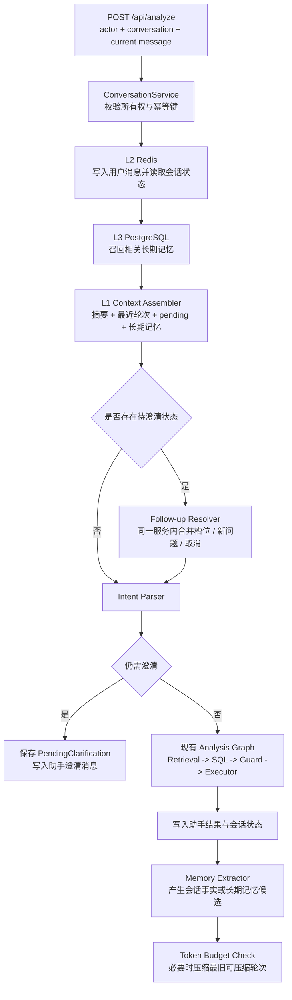

# Agent Conversation Memory Architecture Draft

> 状态：实施中。按 Phase 分模块交付；当前先实施 Phase 0 鉴权与授权，之后实施会话澄清和三层记忆。并发、多线程、乐观锁、幂等重试和 Redis 原子操作明确延后，不纳入本轮代码。

## Goal

为数据分析 Agent 建立三层会话记忆体系，优先解决当前多轮澄清断链问题：Agent 向用户询问缺失信息后，用户下一轮的回答能够与原问题、已确认条件和待补槽位合并，再进入意图解析、SQL 生成和安全执行链路。

目标架构：

1. L1 工作记忆：维护本次模型调用需要的上下文窗口，默认预算 8000 token，超预算时滚动摘要。
2. L2 会话记忆：Redis 写穿保存近 72 小时完整可见会话、滚动摘要、待澄清状态和会话级重要事实。
3. L3 长期记忆：PostgreSQL 保存经过筛选的稳定用户偏好、画像和长期业务上下文，并为未来多用户登录和鉴权预留主体标识。

## Scope

- 设计会话标识、认证主体和受控匿名迁移路径；并发冲突、乐观锁和幂等重试留待后续专项。
- 设计账号注册、登录、注销、会话鉴权、角色授权和会话/记忆所有权绑定。
- 设计结构化澄清续接、`current_analysis` 状态机和 QuerySpec 合并边界。
- 设计 L1 token 预算、双水位、滚动摘要、滞回和上下文优先级。
- 设计 L2 Redis 写穿、72 小时精确保留、容量限制、访问索引和故障降级。
- 设计 L3 长期记忆候选门禁、版本冲突、审计事件、混合召回和用户删除能力。
- 规划后端分层、前端会话恢复、API 兼容、配置、分阶段实施和验证方案。
- 本文只定义开发计划，待审查通过后按 Phase 分模块实施。

## Current Problem

当前链路是单轮请求：

```text
ChatPage -> POST /api/analyze { question }
         -> AgentService.analyze(question)
         -> run_analysis_graph(question)
         -> parse_question_intent(question)
```

当前缺口：

- `AnalyzeRequest` 只有 `question`，没有 `conversation_id`、`turn_id` 或上下文版本。
- `run_analysis_graph()` 在图外直接解析本轮问题；触发澄清后立即返回，没有保存 `QuerySpec`、原始问题或待补槽位。
- 前端会话列表是静态数据，消息只存在 React 组件内存；后续请求仍只发送当前输入文本。
- 已有 `sql_memories` 是“问题到成功 SQL”的执行记忆，不是用户会话记忆，不能承担多轮对话或用户画像职责。

因此，“2017 年”这类澄清回答会被当作一个全新问题，而不是上一轮问题的时间条件。

## Prior Project Design Extraction

参考旧项目 `2026-06-27-agent-memory-3layer-refactor.md` 后，本草案吸收以下成熟设计，并按当前 FastAPI + LangGraph + PostgreSQL 架构重新落位：

| 旧方案机制 | 当前项目采纳方式 |
|---|---|
| 60% / 80% 两级 token 水位 | 改为可配置轻量压缩与激进压缩水位，同时保留 8000 token 硬预算 |
| 结构化 `current_task` | 改为数据分析领域的 `current_analysis`，保存目标、QuerySpec、阶段、约束和 pending 状态 |
| Redis 会话、摘要、高频记忆 | 使用 Stream + HASH/ZSET，增加每轮写穿、精确 72 小时裁剪、容量上限和访问频率 |
| 感知-判断-提炼-存储流水线 | 仅用于 L3 候选晋升；L1/L2 原始会话不能因“短回复”规则被丢弃 |
| 记忆版本链和冲突检测 | 增加 group/version/parent/status，并区分 duplicate/supplement/contradict/unrelated |
| 相关性、时近性、重要性三维评分 | 用于 L3 粗召回后的可解释重排，权重配置化并记录实际分项 |
| 记忆访问事件与来源层追踪 | 增加 `source_layer`、`target_layer`、action、reason 和无正文审计事件 |
| 定时归并和降冷 | 作为后续可靠性阶段；只归并已晋升的长期记忆，不归并全部会话文本 |

以下内容不直接照搬：

- 不引入旧项目的 Java 持久层、客服工单表、客户运维画像或双后端职责划分；本项目后端以 FastAPI 分层为准。
- 不假设本项目已有 Redis 容器；需要先增加明确的本地依赖、健康检查和部署说明。
- 不把 L2 中超过 3 天的所有消息自动下沉 L3；只有通过写入门禁的稳定记忆候选才能晋升。
- 不采用“长度小于 10 字符直接过滤”的通用规则。短回复可能是关键槽位答案、否定、纠正或取消，只能在确认其不属于 pending 回答后用于 L3 噪声过滤。
- Phase 1 不引入 `mem0`。它会引入额外模型、存储抽象和版本语义；当前项目已经有统一 ModelAdapter、EmbeddingAdapter、pgvector 和 repository，先在现有边界内实现并测试。是否采用第三方记忆框架另做技术验证。
- 不把完整版本链全部注入 L1；默认只返回 active 版本和必要冲突摘要，旧版本用于审计或显式复盘，避免挤占上下文。

## Design Principles

- 会话记忆和 SQL Memory 分离：前者解决对话连续性，后者继续解决成功 SQL 复用。
- Redis 对每轮消息写穿保存，不等 L1 满后才写入。L1 满只触发摘要压缩，避免进程重启前的上下文丢失。
- 结构化状态优先于字符串拼接：澄清回答合并到 `QuerySpec` 的缺失槽位，不能简单拼接“原问题 + 用户回答”。
- 当前问题、用户纠正和未解决澄清永不被摘要丢弃。
- 每轮维护结构化 `current_analysis`，使长链路在摘要后仍知道当前目标、进度和下一步。
- 不把完整历史无差别发送给所有模型。意图解析、SQL 生成和结果呈现使用各自最小必要的上下文视图。
- 长期记忆默认少写、可解释、可删除，不从一次数据查询结果推断用户画像。
- 所有读写从第一天携带主体标识和会话所有权，为未来鉴权预留边界。
- Redis 或长期记忆不可用时，不绕过 SQL Guard，也不阻断可独立回答的单轮查询。
- 记忆从候选、激活、替换到撤销必须可追溯；任何自动写入都有来源、置信度、原因和策略版本。
- 澄清续接首先是状态恢复和结构化槽位合并，不为此新增独立 Agent、独立模型或第二套提示词体系。
- 登录鉴权是服务边界，不进入 LangGraph；Agent 只接收已认证主体、允许资源和最小必要的会话上下文。

## Architecture



## L1 Working Memory

### Definition

L1 不是独立持久化数据库，而是每次模型调用前构造的最小上下文包。建议结构：

```text
system instructions
conversation rolling summary
confirmed facts and constraints
pending clarification state
recent uncompressed turns
relevant long-term memories
current user message
task-specific schema / metric / SQL context
```

### Token Budget

- 默认 `MEMORY_L1_TOKEN_BUDGET=8000`，配置化，不写死在业务逻辑中。
- 8000 token 指完整输入消息预算，不只统计聊天文本；必须给模型输出、系统指令、schema/metric 上下文预留空间。
- 有效预算应取：`min(configured_budget, model_context_limit - reserved_output - safety_margin)`。
- 引入 `TokenCounter` 接口：优先使用与当前模型匹配的 tokenizer；不可用时使用保守估算并标记 `estimated=true`。不能假设 `tiktoken` 对 Qwen 等本地模型精确。
- 不同模型调用使用不同上下文视图：Follow-up Resolver 可看对话摘要和最近轮次；SQL Generator 只接收已解析的有效问题、QuerySpec、相关偏好及现有 schema/metric 上下文。

### Compression Strategy

参考旧项目的双水位机制，使用三级行为而不是等到预算耗尽：

```text
token 使用率 < 60%       -> 正常追加，不压缩
token 使用率 60%-80%     -> 轻量压缩最旧的已闭合轮次
token 使用率 > 80%       -> 激进压缩，只保留关键结构、摘要和最近完整轮次
超过有效硬预算          -> 必须再次裁剪，禁止向模型发送超限请求
```

水位默认值为 60%/80%，但必须通过配置读取。执行步骤：

1. 固定保留当前用户消息、最近 4 个完整轮次、所有未解决澄清、用户纠正和明确约束。
2. 轻量压缩时，从最旧且已闭合的轮次开始按块生成结构化摘要，保留较多最近原文。
3. 激进压缩时，只保留 `current_analysis`、滚动摘要、最近 3-4 个完整轮次和高相关记忆。
4. 摘要必须保留：对话目标、确认指标、时间范围、筛选条件、业务口径、用户纠正、已做决定、未解决问题和实体名称。
5. 将新摘要和 `summary_version` 写入 Redis；原始消息继续保留到 72 小时到期，不因压缩而删除。
6. 再次计算 token；仍超预算时减少低相关长期记忆和旧结果说明，不能删除 pending 状态。
7. 摘要模型失败时，退回确定性裁剪并保留关键结构化字段，同时记录降级指标。

压缩后需设置默认 5% 滞回：例如触发 80% 激进压缩后，只有降到 75% 以下才视为退出该水位，防止每轮在临界值重复调用摘要模型。

建议摘要结构：

```json
{
  "conversation_goal": "",
  "confirmed_facts": [],
  "constraints": [],
  "user_corrections": [],
  "decisions": [],
  "open_questions": [],
  "referenced_entities": [],
  "covered_through_turn": 0
}
```

摘要还需要记录 `source_turn_ids`、`summary_model`、`prompt_version` 和 `created_at`，使错误摘要可以定位来源并重新生成。

### Structured Current Analysis

旧方案的 `current_task` 对本项目仍然有价值，但需要改造成数据分析状态，作为 L1 固定区和 Redis 快照：

```json
{
  "current_analysis": {
    "analysis_id": "uuid",
    "status": "awaiting_clarification",
    "original_question": "帮我看看销售情况",
    "resolved_question": "",
    "goal": "查询 2017 年销售额",
    "phase": "clarification|intent|retrieval|sql_generation|execution|presentation|completed",
    "query_spec": {},
    "missing_slots": ["metric", "time_range"],
    "confirmed_constraints": [],
    "user_corrections": [],
    "completed_steps": [],
    "next_step": "resolve_clarification",
    "pending_clarification_id": "uuid-or-null",
    "state_version": 1
  }
}
```

- `current_analysis` 从 Agent 状态和 `PendingClarification` 确定性派生，不允许模型自由编写流程状态。
- 每个阶段完成后更新 Redis 快照；摘要压缩不得修改其语义。
- `completed`、`cancelled` 或被新问题替代后关闭，不能污染后续独立问题。
- 不在这里保存完整结果集或原始内部错误，只保存恢复任务所需的结构化状态。

## L2 Redis Session Memory

### Write Policy

Redis 使用写穿策略：每个用户消息和助手可见回复生成后立即写入。L1 超预算时只更新摘要，不负责首次持久化消息。

建议键空间：

```text
conversation:{conversation_id}:meta       HASH
conversation:{conversation_id}:messages   STREAM
conversation:{conversation_id}:summary    JSON/STRING
conversation:{conversation_id}:pending    JSON/STRING
conversation:{conversation_id}:facts      HASH
actor:{actor_id}:conversations             ZSET
idempotency:{actor_id}:{client_turn_id}    STRING
memory:recent:{actor_id}                    ZSET(memory_id only)
```

`memory:recent` 只存长期记忆 ID 和访问分数，记忆正文仍以 PostgreSQL 为准，避免 Redis JSON 副本与 L3 版本不一致。

### Retention

- 消息保留最近 72 小时，使用 Redis Stream `XTRIM MINID` 按消息时间裁剪，而不是只依赖整键滑动 TTL。
- 会话无活动 72 小时后，meta、summary、pending 和 facts 整体过期。
- 每次写入以事务或 Lua 脚本原子更新消息、会话版本、最后活动时间和 TTL。
- `client_turn_id` 用于防止网络重试产生重复消息或重复 SQL 执行。
- 每次 L2/L3 记忆实际注入 L1 后更新 `last_used_at/retrieval_count` 和 recent ZSET；“召回但未注入”不能计为使用。

### Capacity Limits

除时间保留外，还必须设置容量上限，防止单个会话挤占 Redis：

| 参数 | 建议默认值 | 行为 |
|---|---:|---|
| `MEMORY_L2_MAX_MESSAGES` | 100 | 超出后裁剪最旧且已进入摘要的消息；pending 来源轮次固定保留 |
| `MEMORY_L2_MAX_MESSAGE_BYTES` | 32 KB | 拒绝或截断超大可见消息，保留哈希和截断标记 |
| `MEMORY_L2_MAX_RESULT_PREVIEW_ROWS` | 5 | 与当前前端预览一致，不保存全量 rows |
| `MEMORY_L2_MAX_RESULT_PREVIEW_BYTES` | 64 KB | 超限仅保存列名、行数和结果引用 |
| `MEMORY_L2_MAX_FACTS` | 50 | 按重要度、最近确认和访问频率淘汰低价值会话事实 |
| `MEMORY_L2_SUMMARY_MAX_TOKENS` | 1200 | 摘要本身也必须受预算约束 |
| `MEMORY_IDEMPOTENCY_TTL_HOURS` | 72 | 与会话保留期一致 |

容量裁剪和时间裁剪都必须保留 `current_analysis`、pending、当前轮次及其直接来源，且写入裁剪原因与数量指标。

### Stored Content

“完整会话”定义为用户实际看到的会话内容：用户消息、助手澄清、回答摘要、最终 SQL 引用和有限结果预览。以下内容不进入普通会话消息：完整 prompt、工具内部 payload、原始异常、密钥、全量查询结果和向量。

### Failure Behavior

- Redis 短暂不可用：独立单轮问题继续执行，但返回内部 `memory_degraded` 状态并记录诊断；需要上文才能回答的问题应要求用户重述，不能伪造上下文。
- 开发环境可提供有界内存实现用于测试，但明确标记为单进程降级，不作为生产替代。

## L3 PostgreSQL Long-Term Memory

### Boundary

L3 只存稳定、可复用、与用户主体相关的事实，例如：

- 用户明确要求记住的回答格式、货币、默认时间范围、常用指标或业务域。
- 多次确认且稳定的分析偏好。
- 用户明确纠正过的业务术语和口径偏好。

不存：密码、连接串、密钥、原始工具错误、完整 prompt、一次查询的结果值、未经确认的模型推断和短期临时筛选条件。

### Proposed Schema

新建迁移，不修改已应用迁移。建议拆为：

```text
memory_subjects
- id UUID PK
- subject_type: anonymous | user
- external_user_id nullable
- status
- created_at / updated_at

long_term_memories
- id UUID PK
- subject_id UUID FK
- memory_type: preference | profile | terminology | business_context
- memory_key
- content
- structured_value JSONB
- memory_group_id UUID
- revision INTEGER
- supersedes_memory_id UUID nullable
- confidence
- importance
- source_conversation_id
- source_turn_id
- status: active | superseded | revoked
- scope_tags JSONB
- retrieval_count INTEGER
- last_verified_at nullable
- expires_at nullable
- embedding vector(1536) nullable
- created_at / updated_at / last_used_at

long_term_memory_events
- id UUID PK
- memory_id UUID nullable
- subject_id UUID
- action: candidate_created | created | retrieved | superseded | revoked | deleted | consolidated
- source_layer: l1 | l2 | l3
- target_layer: l2 | l3 | none
- reason_code
- scores JSONB
- policy_version
- conversation_id / turn_id nullable
- created_at
```

`(subject_id, memory_type, memory_key, status)` 需要受控唯一性或 repository 级 supersede 逻辑，避免同一偏好无限追加冲突值。

`embedding` 维度必须复用当前 `settings.embedding_dimensions` 和 EmbeddingAdapter，计划中的 1536 仅表示当前默认值，不能在 migration 之外的业务逻辑重复硬编码。事件表默认不保存记忆正文，只保存动作、原因和分数。

### Extraction And Retrieval

- V1 仅自动保存用户显式表达“记住、以后默认、我更喜欢”等允许类型；其他内容只生成候选，不直接持久化。
- 提取结果必须是结构化 JSON，并经过 allowlist、敏感信息过滤、置信度阈值和冲突检测。
- 检索先按主体和类型过滤，再使用关键词、最近使用时间及可选 pgvector 分数排序，默认最多注入 3-5 条。
- 长期记忆在 Prompt 中作为不可信用户上下文处理，不能覆盖系统指令或 SQL 安全规则。
- 必须预留查看、修改、删除和“不要记住这条”能力。

### Long-Term Write Pipeline

吸收旧方案“感知-判断-提炼-存储”的思路，但将规则收紧到数据分析用户偏好：

```text
[Candidate]
显式“记住/以后默认/我更喜欢/术语是”或受控重复确认
    -> [Filter]
主体校验 + allowlist + 敏感信息过滤 + 临时条件识别
    -> [Judge]
explicitness + stability + reuse_value + confidence
    -> [Extract]
按 memory_type 的 Pydantic schema 生成结构化候选
    -> [Conflict]
duplicate | supplement | contradict | unrelated
    -> [Policy]
insert | supersede | ignore | require_review
    -> [Repository]
确定性执行状态迁移、向量写入和审计事件
```

关键约束：

- LLM 只输出候选、关系和建议动作，不能直接 update/merge/delete 数据库记录。
- “短文本”不等于低价值；`记住用人民币`、`改成美元`、`不要记住` 都必须进入显式指令识别。
- L3 写入异步失败不能把已经成功的数据分析响应改成失败；失败候选进入重试或审计，不静默宣称已记住。
- 一次查询得到的销售额、SQL、rows、工具结论不能自动晋升为用户画像。
- 分值建议统一到 0-1，并记录分项。V1 显式记忆可要求 `explicitness=1` 且通过类型和敏感信息门禁；其他自动候选默认只进入 review 状态。

### Versioning And Conflict Policy

- 同一 `subject_id + memory_type + memory_key` 属于同一 `memory_group_id`。
- 新值与 active 值相同：`duplicate -> ignore`，只更新访问或验证时间。
- 新值补充可合并字段：`supplement -> insert new revision`，旧记录 superseded，保留来源。
- 新值与旧值冲突且用户明确纠正：`contradict -> supersede`，新值 active，旧值可追溯但不再召回。
- 模型无法判断或来源不明确：`require_review`，不得覆盖 active 值。
- 用户执行“忘记”时立即将 active 记忆 revoked，并清理 Redis recent 索引和后续 Prompt 缓存；是否保留最小审计事件由隐私策略确认。
- 后续定期整合仅处理同 group 多版本候选，必须保留来源和 `known_ambiguities`，禁止无来源补写事实。

### Retrieval Ranking

L3 检索采用“元数据预过滤 + 混合召回 + 可解释重排”：

1. 按 `subject_id`、`status=active`、memory_type、scope 和 expiry 预过滤。
2. 通过关键词和 pgvector 召回候选；embedding 不可用时退回关键词，不阻断会话。
3. 使用多维分数排序：

```text
final_score = alpha * relevance
            + beta  * recency
            + gamma * importance
            + delta * confidence
```

建议初始权重：相关性 0.55、时近性 0.15、重要性 0.15、置信度 0.15，最终由会话记忆评测校准。每次 trace 记录分项但不记录正文。粗召回可取 Top 20，最终最多注入 3-5 条；现阶段不要求额外 Cross-Encoder，后续只有在评测证明有收益时再增加精排模型。

上下文冲突优先级固定为：

```text
系统与安全规则
> 当前用户明确指令
> 当前 QuerySpec / 用户纠正 / pending
> 当前会话已确认事实
> L3 active 偏好
> 滚动摘要和旧轮次
```

长期偏好与当前指令冲突时，本轮使用当前指令，并可生成“是否更新长期偏好”的候选，不能暗中覆盖。

## Memory Taxonomy

| 类型 | 层 | 生命周期 | 用途 |
|---|---|---|---|
| `message` | L2，按需进入 L1 | 72 小时 | 用户和助手可见会话原文 |
| `conversation_summary` | L1/L2 | 随压缩版本更新，最长 72 小时 | 压缩已闭合旧轮次 |
| `current_analysis` | L1/L2 | 当前分析任务 | 恢复目标、进度、QuerySpec 和约束 |
| `pending_clarification` | L1/L2 | 回答、取消、替换或过期前 | 保存待补槽位，不是普通摘要 |
| `conversation_fact` | L1/L2 | 会话期间或 72 小时 | 当前会话已确认但未晋升的事实 |
| `long_term_memory` | L3，相关时进入 L1 | active/revoked/superseded/expired | 稳定偏好、术语和画像 |
| `sql_memory` | 现有 L3 执行记忆 | 按现有策略 | 成功 SQL 复用，与用户对话记忆隔离 |

任何实现都不能把 `sql_memory` 当成聊天上下文，也不能把一次 `conversation_fact` 未经门禁直接写成长期画像。

## Active Task Lifecycle

`current_analysis.status` 建议状态机：

```text
created
  -> awaiting_clarification
  -> ready
  -> running
  -> completed
  -> cancelled
  -> expired
  -> replaced
```

- `awaiting_clarification`：必须有 pending ID、missing slots 和来源 turn。
- `ready`：QuerySpec 已满足最低执行要求，才能进入现有分析图。
- `running`：按阶段更新 state version；同一任务只允许一个 active 执行。
- `completed/cancelled/expired/replaced`：终态，后续消息不能继续修改该任务。
- 用户提出明显新问题时将旧任务标记 `replaced`；不相关短句不能误合并到旧 pending。
- `expected_conversation_version`、`parent_turn_id` 乐观锁和冲突重试保留为后续并发专项设计；本期单请求顺序流程不实现这些字段或 `409` 行为。

## Memory Manager Contract

三层对上层提供统一协调接口，但 service 仍负责业务事务和所有权：

```text
start_or_load_conversation(actor, conversation_id)
append_user_turn(conversation, client_turn_id, content)
build_context(conversation, purpose)
resolve_pending(conversation, current_message)
save_pending(conversation, pending_state)
complete_turn(conversation, visible_response, analysis_state)
extract_long_term_candidates(conversation, turn)
retrieve_long_term(subject, query, types, limit)
forget_memory(subject, memory_id)
delete_conversation(actor, conversation_id)
```

接口返回统一诊断：`source_layer`、`target_layer`、token 计数、compression action、hit/miss、degraded reason 和 latency；不返回或记录消息正文到普通日志。

## Clarification Continuation Contract

这是第一阶段必须完成的最小闭环。

建议保存：

```json
{
  "original_question": "帮我看看销售情况",
  "normalized_question": "查询销售情况",
  "partial_query_spec": {
    "metrics": [],
    "time_range": ""
  },
  "missing_slots": ["metric", "time_range"],
  "assistant_question": "你希望查看哪个指标和时间范围？",
  "created_turn": 1
}
```

下一轮输入经过 Follow-up Resolver，输出三种决策：

- `answer_pending`：回答了待补信息，合并到原 QuerySpec 后继续执行。
- `new_question`：与澄清无关，关闭旧 pending 并按新问题处理。
- `cancel`：用户取消当前任务，关闭 pending，不执行 SQL。

Follow-up Resolver 是确定性工具组件，不是独立“澄清助手”或新的 LangGraph 节点循环：

1. 读取 `PendingClarification.missing_slots`，先用日期、指标、维度、确认/取消等确定性解析器填槽。
2. 对槽位已完整覆盖的输入直接合并 `partial_query_spec`，不再调用模型。
3. 仅当输入无法判断是“回答追问”还是“新问题”时，复用现有 `question_intent_parser` 的 ModelAdapter 与 QuerySpec schema，输出 `answer_pending/new_question/cancel` 的结构化决策。
4. Resolver 记录 `resolution_source=deterministic|intent_model`、填充槽位和 state version；它不生成面向用户的自然语言回复，也不直接生成或执行 SQL。

这保留单一意图模型和单一 QuerySpec 真相来源，避免多 Agent 的上下文漂移、重复提示词和额外延迟。

合并后必须重新经过 Intent/QuerySpec 校验，最终 SQL 仍经过 Guard 和只读 Executor。

核心验收场景：

```text
用户：帮我看看销售情况
助手：你希望查看销售额、订单数还是客单价？时间范围是什么？
用户：销售额，2017 年
系统有效问题：查询 2017 年销售额
```

禁止仅生成：`帮我看看销售情况 销售额，2017 年`。必须形成可验证的结构化 QuerySpec。

## API Contract Draft

保持现有调用兼容，为 `POST /api/analyze` 增加可选字段：

```json
{
  "question": "销售额，2017 年",
  "conversation_id": "uuid-or-null",
  "client_turn_id": "uuid",
  "parent_turn_id": "uuid-or-null",
  "expected_conversation_version": 3
}
```

响应增加：

```json
{
  "conversation_id": "uuid",
  "turn_id": "uuid",
  "conversation_version": 4,
  "resolved_question": "查询 2017 年销售额",
  "awaiting_clarification": false
}
```

- 已登录客户端不传 `conversation_id` 时，后端为当前用户创建新会话并在响应返回 ID。
- 前端必须在后续消息复用响应中的 `conversation_id`。
- `resolved_question` 主要用于诊断和可信解释，普通界面是否展示另行确认。
- 重复 `client_turn_id` 返回第一次执行的同一结果，不重复调用模型或执行 SQL。
- `expected_conversation_version` 不匹配时返回结构化 `409 stale_conversation_version`，由前端刷新会话后重试或提示冲突。

建议错误类别：

| HTTP | code | 场景 |
|---:|---|---|
| 404 | `conversation_not_found` | 会话不存在或已过期 |
| 401 | `authentication_required` | 未登录、会话失效或认证 Cookie 缺失 |
| 403 | `conversation_forbidden` | 当前主体不是会话所有者 |
| 409 | `stale_conversation_version` | 后续并发专项才启用；本期不返回该错误 |
| 409/200 | `duplicate_turn` | 幂等键重复；优先返回已缓存结果 |
| 503 | `conversation_memory_unavailable` | 当前回答必须依赖上文，但 Redis 不可恢复 |

`memory_degraded` 作为内部 trace 或可选诊断字段，不在普通用户页面暴露 Redis、embedding 或模型细节。

后续会话管理接口：

```text
POST   /api/conversations
GET    /api/conversations
GET    /api/conversations/{conversation_id}/messages
DELETE /api/conversations/{conversation_id}
GET    /api/memory/profile
DELETE /api/memory/items/{memory_id}
```

API 变更实施时必须同步 routes、Pydantic schema、service、前端 client/type、API 文档和 smoke。

## Authentication And Identity

认证是本计划的 Phase 0，不再把匿名 `actor_id` 作为长期默认身份。当前业务数据表 `users` 是 Olist 电商客户维表，绝不能复用为应用登录用户；认证必须新建独立表和 repository。

### Identity Model

```text
app_users
- id UUID PK
- email_normalized TEXT UNIQUE
- display_name TEXT
- password_hash TEXT
- role: analyst | admin
- status: active | disabled
- created_at / updated_at / last_login_at

auth_sessions
- id UUID PK
- user_id UUID FK app_users
- session_token_hash TEXT UNIQUE
- csrf_token_hash TEXT
- created_at / last_seen_at
- idle_expires_at / absolute_expires_at
- revoked_at nullable
- user_agent_hash / ip_prefix_hash nullable

auth_events
- id UUID PK
- user_id nullable
- action: register | login_success | login_failed | logout | session_revoked | password_changed
- reason_code
- request_fingerprint_hash nullable
- created_at
```

- 所有 conversation、long-term memory、query run 和后续用户级 SQL Memory 都使用 `app_users.id` 或内部 `memory_subjects.user_id` 绑定所有权。
- `query_runs`、`tool_calls` 和调试读取接口必须增加 owner 过滤，避免已登录用户读取其他人的问题、SQL 或工具摘要。
- 现有系统级 SQL Memory 与用户私有记忆分离；历史 `sql_memories` 默认按系统模板处理，不能被当作任意用户的私有聊天记录。
- 未来多租户数据隔离、组织、行级权限和 API Key 另立计划；登录认证不自动解决底层业务数据的租户隔离。

### Session Strategy

V1 使用服务端可撤销的随机不透明会话 Cookie，不将 JWT 或 refresh token 暴露给 JavaScript：

- 登录成功后写入 `HttpOnly`、`SameSite=Lax`、生产环境 `Secure` 的 `session` Cookie；Cookie 只存高熵随机 token，数据库仅存 token 哈希。
- 默认空闲过期 12 小时、绝对过期 7 天，具体值配置化；每次受保护请求更新 `last_seen_at`，但不无限延长绝对过期。
- 同时签发非 HttpOnly CSRF token Cookie；所有修改状态的 Cookie 认证请求必须发送 `X-CSRF-Token`，服务端使用恒定时间比较其哈希。
- `POST /api/auth/logout` 撤销服务端 session 并清除两类 Cookie；密码变更、管理员禁用用户时撤销该用户全部 session。
- 认证 Redis 限流不可用时，登录、注册和密码修改应 fail closed；会话记忆 Redis 不可用时的单轮查询降级策略与其分开。

### Password And Registration Policy

- 使用 `pwdlib[argon2]` 的 Argon2id 哈希，禁止明文、可逆加密、SHA/MD5 或自行实现密码算法。
- 最小密码长度 12，最大长度 128；服务端验证，前端只做体验提示。
- 邮箱统一小写和去首尾空格；注册、登录、重置失败都返回不泄露账号存在性的通用错误。
- `AUTH_ALLOW_SELF_REGISTRATION` 控制是否开放注册；生产环境首个管理员由显式 bootstrap 配置或运维脚本创建，不采用“第一个注册用户自动管理员”的竞态规则。
- 登录和注册按 IP 指纹与标准化邮箱限流，返回 `429` 和可用的 `Retry-After`。
- 当前没有邮件服务，本阶段不实现真实“忘记密码”邮件流程；前端入口应改为不可用说明或暂时隐藏，不能保留跳转成功的假功能。

### Authorization Matrix

| 资源 | analyst | admin |
|---|---|---|
| 数据问答、本人会话、本人长期记忆 | 允许 | 允许 |
| 本人 profile、登出、修改密码 | 允许 | 允许 |
| 指标读取 | 允许 | 允许 |
| 指标 CRUD | 拒绝 | 允许 |
| `/api/runs`、`/api/memories` 调试接口 | 拒绝 | 允许，且只按权限范围读取 |
| 用户禁用、角色调整、会话撤销 | 拒绝 | 允许 |

路由依赖应区分 `get_current_user`、`require_role` 和 `get_current_subject`。不能只在前端隐藏菜单，后端必须实际校验。

### Anonymous Transition

- 认证启用前的本地单机开发可使用明确的 `AUTH_REQUIRED=false` 开关和服务端固定开发主体，不能接受客户端任意 owner ID。
- `AUTH_REQUIRED=true` 时，`/api/analyze`、会话、profile 和记忆接口都需要登录；前端未登录跳转 `/login`。
- 若保留认证前产生的 72 小时匿名会话，登录后只允许通过一次性、用户确认的迁移绑定到当前用户；未认领会话按 TTL 过期。
- 所有生产环境必须拒绝 `AUTH_REQUIRED=false`、缺失 CSRF signing secret、`Secure=false` 或默认 bootstrap 密码等不安全配置。

### Authentication API Draft

```text
POST /api/auth/register       注册；受 AUTH_ALLOW_SELF_REGISTRATION 控制
POST /api/auth/login          建立服务端 session 和 CSRF Cookie
POST /api/auth/logout         撤销当前 session
GET  /api/auth/me             当前用户、角色和 session 到期信息
PUT  /api/auth/password       需要旧密码和 CSRF，修改后撤销其他 session
POST /api/auth/sessions/revoke-all  撤销本人全部其他 session
```

认证错误统一为 `401 authentication_required`、`401 invalid_credentials`、`403 forbidden`、`409 email_already_registered`、`422 invalid_password_policy` 和 `429 rate_limited`。普通页面不展示认证内部原因、哈希、session ID 或限流 key。

## Configuration Draft

```text
MEMORY_ENABLED=true
REDIS_URL=redis://127.0.0.1:6379/0
MEMORY_L1_TOKEN_BUDGET=8000
MEMORY_L1_LIGHT_COMPRESSION_RATIO=0.60
MEMORY_L1_AGGRESSIVE_COMPRESSION_RATIO=0.80
MEMORY_L1_COMPRESSION_HYSTERESIS_RATIO=0.05
MEMORY_L1_RECENT_TURNS=4
MEMORY_L1_RESERVED_OUTPUT_TOKENS=1200
MEMORY_L2_RETENTION_HOURS=72
MEMORY_L2_MAX_MESSAGES=100
MEMORY_L2_MAX_MESSAGE_BYTES=32768
MEMORY_L2_MAX_RESULT_PREVIEW_ROWS=5
MEMORY_L2_MAX_RESULT_PREVIEW_BYTES=65536
MEMORY_L2_MAX_FACTS=50
MEMORY_L2_SUMMARY_MAX_TOKENS=1200
MEMORY_L3_RETRIEVAL_LIMIT=5
MEMORY_L3_STAGE1_LIMIT=20
MEMORY_L3_RELEVANCE_WEIGHT=0.55
MEMORY_L3_RECENCY_WEIGHT=0.15
MEMORY_L3_IMPORTANCE_WEIGHT=0.15
MEMORY_L3_CONFIDENCE_WEIGHT=0.15
MEMORY_SUMMARY_MODEL_PROVIDER=<optional>
MEMORY_SUMMARY_MODEL_NAME=<optional>
AUTH_REQUIRED=true
AUTH_ALLOW_SELF_REGISTRATION=false
AUTH_SESSION_IDLE_HOURS=12
AUTH_SESSION_ABSOLUTE_DAYS=7
AUTH_COOKIE_NAME=local_data_agent_session
AUTH_CSRF_SIGNING_SECRET=change_me
AUTH_CSRF_COOKIE_NAME=local_data_agent_csrf
AUTH_LOGIN_RATE_LIMIT_PER_15_MINUTES=10
AUTH_REGISTER_RATE_LIMIT_PER_HOUR=5
AUTH_BOOTSTRAP_ADMIN_EMAIL=<optional>
```

秘密值只进入本地 `.env`，示例文件只保留占位符。

## Module Boundaries

实施时建议遵循现有分层：

- `backend/app/api/auth.py`：认证 HTTP 路由和 Cookie 写入，只处理契约。
- `backend/app/core/security.py`：Argon2id 哈希、token、CSRF、Cookie 和恒定时间比较，不包含业务 SQL。
- `backend/app/services/auth_service.py`：注册、登录、注销、密码变更、限流和 session 撤销编排。
- `backend/app/api/dependencies.py`：`get_current_user`、`require_role`、CSRF 依赖和路由授权。
- `backend/app/db/repositories/auth_repository.py`：应用用户、认证 session 和 auth event 持久化。
- `backend/app/api/`：会话和记忆路由，只处理 HTTP 契约。
- `backend/app/services/conversation_service.py`：会话轮次、所有权、幂等和跨层编排。
- `backend/app/services/memory_service.py`：三层 MemoryManager 门面、L1/L2/L3 读写策略与降级。
- `backend/app/agents/analysis_graph.py`：接收已解析的会话上下文和有效问题，不直接操作 Redis。
- `backend/app/tools/context_window.py`：token 计数、预算分配和摘要压缩。
- `backend/app/tools/followup_resolver.py`：待澄清状态识别与 QuerySpec 合并。
- `backend/app/tools/memory_extractor.py`：长期记忆候选提取和安全过滤。
- `backend/app/db/repositories/`：长期记忆和 memory event PostgreSQL repository。
- `backend/app/schemas/`：auth、conversation、memory、pending clarification 契约。
- `frontend/src/api/`、`frontend/src/types/`、`ChatPage.tsx`：认证请求、真实会话 ID、会话列表和消息恢复。
- `frontend/src/auth/` 或等价 provider：当前用户加载、路由守卫、登出和 401 处理。

## Layer Coordination Scenarios

### Normal Multi-Turn

每轮先写 L2，再由 L1 按预算读取摘要、current_analysis 和最近轮次；低于轻量水位时不调用摘要模型。L3 只召回与当前任务相关的少量 active 记忆。

### Long Conversation

达到轻量水位后压缩最旧闭合轮次；达到激进水位后固定保留 current_analysis、pending、纠正和最近轮次。原始消息仍在 L2，摘要失败时走确定性裁剪。

### Cross-Conversation Preference

新会话根据当前认证主体检索 active 偏好，经过上下文优先级和 token 上限后注入。当前用户明确要求覆盖历史偏好，但不会未经确认修改长期记录。

### Correction And Forget

“以后改用美元”产生 contradict/supersede；“忘记货币偏好”产生 revoke 并清理 recent 索引。旧版本不再进入 Prompt，但保留受控来源或按删除策略彻底清理。

### Layer Failure

| 故障 | 降级行为 |
|---|---|
| Tokenizer 不可用 | 使用保守估算并降低可用预算，标记 estimated |
| 摘要模型失败 | 保留 current_analysis/pending/最近轮次，确定性裁剪 |
| Redis 不可用 | 独立单轮继续；依赖上文则要求重述，不伪造恢复 |
| PostgreSQL L3 不可用 | 不注入长期记忆，当前会话继续 |
| Embedding 不可用 | L3 使用结构化过滤和关键词检索 |
| Memory extraction 失败 | 主分析结果保持成功，记录候选失败并按策略重试 |

## Observability And Audit

运行诊断应记录但不记录正文：

- `conversation_id`、turn、state version 和 pending decision。
- L1 `tokens_before/tokens_after/effective_budget/estimated`、压缩级别和 summary version。
- L2 read/write/trim latency、message count、TTL、hit/miss 和 degraded reason。
- L3 candidate/retrieved/injected 数量、source layer、分项分数、策略版本和状态迁移。
- clarification resolved/new_question/cancel 比例、重复 turn 命中和 stale version 冲突数。
- 记忆对最终回答是否实际注入和使用；只召回未注入不能计入 memory hit。

审计事件用于回答“为什么记住、从哪里来、何时被替换或删除”，普通业务日志不输出记忆内容、Prompt、Redis key 中的主体标识或敏感数据。

## Implementation Steps

### Phase 0: Authentication And Authorization Foundation

- [x] 新增应用认证 migration：`app_users`、`auth_sessions`、`auth_events`；不修改 Olist `users` 表。
- [x] 使用 `005_auth_and_user_ownership.sql` 补充 query run 所有者，不重写已应用迁移。
- [x] 新增 Argon2id 密码服务、随机 session token、CSRF token、Cookie 安全配置和生产启动校验。
- [x] 新增注册、登录、注销、`/auth/me`、密码变更和自身 session 撤销服务/路由/Pydantic 契约。
- [x] 新增认证依赖和 `analyst/admin` 角色授权；保护 `/api/analyze`、SQL Memory、指标写入和调试接口。
- [ ] 为会话和长期记忆增加主体所有权及 repository 过滤；审计和 SQL Memory 的 scope 策略单独覆盖（待 Phase 1/3）。
- [x] 前端将 Login/Register 接入真实 API，增加 AuthProvider、路由守卫、Cookie credentials、CSRF header 和登出；移除假登录跳转。
- [x] 补登录/注册 Redis 限流（非生产内存回退、生产 fail closed）、session 撤销、跨用户会话、CSRF、角色拒绝、未登录和密码哈希测试。

### Phase 1: Conversation Continuity MVP

- [x] 定义 `conversation_id`、`PendingClarification` 和响应兼容契约；`client_turn_id`/`turn_id` 幂等字段按延期范围不实现。
- [x] 复用 Phase 0 `AuthPrincipal` 绑定会话和记忆所有权；开发固定主体仅使用受限匿名 owner。
- [x] 增加 Redis adapter、开发/测试内存回退和 72 小时 retention。
- [x] 定义 `current_analysis` 状态机和终态清理规则；版本冲突语义延期。
- [x] 每轮写穿保存用户消息、助手澄清和助手结果预览。
- [x] 在 Intent Parser 前增加 Follow-up Resolver，支持 `answer_pending/new_question/cancel`。
- [ ] 本期不实现 `client_turn_id` 幂等、会话乐观锁或并发冲突响应；后续专项处理。
- [x] 前端复用 `conversation_id`，用真实会话和消息替换静态列表。
- [x] 完成“澄清后继续执行”的 API 端到端测试。

### Phase 2: L1 Token Buffer And Compression

- [x] 定义可替换 `TokenCounter` 和模型上下文上限配置。
- [x] 实现 8000 token 预算、输出预留和 60%/80% 双水位；当前只向意图模型提供压缩上下文。
- [x] 实现确定性结构化滚动摘要、关键状态固定和摘要版本。
- [x] 将摘要写回会话状态，Redis 保留 72 小时原始消息。
- [x] 实现会话消息、摘要和结果预览容量边界；不保存完整 SQL 或 rows。
- [x] 覆盖 7999/8000/8001 边界、中文长文本和 pending 不丢失测试；模型摘要失败场景使用确定性摘要降级。

### Phase 3: L3 Long-Term Memory

- [x] 新增长期记忆 migration，不修改 `003_agent_metadata.sql` 等已应用迁移。
- [x] 实现 subject、memory、memory event repository、版本链、冲突替换、撤销和删除。
- [x] V1 以明确“记住/默认/忘记”命令作为 Candidate/Filter/Policy 门禁；不使用 LLM 自动画像写入。
- [x] 实现显式偏好提取、allowlist 和 active 元数据过滤；向量混合召回和复杂重排延期到偏好类型扩展时。
- [x] 将少量 active 长期偏好注入 Intent 上下文，不直接注入 SQL 执行器。
- [x] 增加用户查看和删除长期记忆的 API 契约、前端控制与测试。

### Phase 4: Reliability, Evaluation And Identity Evolution (Deferred)

- [ ] 增加同会话并发版本检查、幂等重试和 Redis 原子操作（用户明确延后）。
- [ ] 增加 Redis 故障降级、恢复和进程重启连续性测试。
- [ ] 增加同 key 多版本整合候选，保留来源和已知歧义；默认不自动执行无审核合并。
- [ ] 增加会话记忆评测集，覆盖澄清、纠正、话题切换、摘要和长期偏好。
- [ ] 增加不含消息正文的记忆命中、压缩、token、延迟和降级指标。
- [ ] 更新 API、架构、数据模型、部署、隐私与 handoff 文档。
- [ ] 为 OAuth、MFA、组织/租户、API Key、匿名会话认领和跨设备记忆合并写独立计划。

## Validation Plan

### Unit Tests

- Argon2id 哈希与验证、随机 token 不明文落库、Cookie 属性、CSRF 恒定时间校验和生产配置拒绝。
- 登录/注册限流、通用 invalid credentials 错误、session idle/absolute expiry 和撤销。
- `get_current_user`、角色拒绝、开发者接口保护和 Olist `users` 表未被认证代码访问。
- token 计数与 8000 token 压缩边界。
- 60%/80% 水位及滞回行为，避免在阈值附近重复摘要。
- 摘要保留确认事实、用户纠正、待补槽位和最近轮次。
- 重复压缩时 summary version 单调递增，否定、日期和来源 turn 不丢失。
- Follow-up Resolver 正确区分回答澄清、新问题和取消。
- QuerySpec 合并后仍执行现有意图和 SQL 语义校验。
- 长期记忆 allowlist、敏感信息拒绝、冲突 supersede 和删除。
- 短句显式偏好可晋升，短句 pending 回答不会被噪声过滤。
- 当前明确指令始终覆盖长期偏好，记忆中的 Prompt Injection 不得覆盖系统和 SQL 安全规则。

### Integration Tests

- 注册、登录、`/auth/me`、注销、密码变更、其他 session 撤销和 auth event migration/repository。
- Cookie 认证请求携带 CSRF header 才能修改状态；缺失/伪造 CSRF 被拒绝。
- `query_runs`、conversation、long-term memory 按 authenticated user 隔离；admin 与 analyst 权限矩阵生效。
- Redis Stream 顺序、72 小时裁剪和 TTL；原子版本和幂等键延后。
- 72 小时按消息裁剪不误删活跃窗口、pending 来源和 current_analysis。
- 服务进程重建后能从 Redis 继续会话。
- PostgreSQL migration、repository、主体隔离和长期记忆检索。
- Redis 不可用时单轮查询可用，依赖上文的问题明确降级。
- Redis、L3、embedding、tokenizer 和摘要模型分别故障时符合降级矩阵。
- 删除会话清理全部 Redis keys、actor 索引和幂等结果；删除长期记忆同时清理向量和 recent 索引。

### API And Frontend Tests

- 未登录访问受保护 API 返回 401 且路由守卫跳转登录；登录后恢复原目标页面。
- 登录、注册、注销不再是静态 Link 跳转；`fetch` 使用 `credentials: 'include'` 并为状态变更发送 CSRF header。
- 401 会清空前端当前用户状态，不泄露或循环重试；403 仅显示权限提示。
- 已登录请求仅传 `question` 仍可工作并返回新会话 ID。
- 同一 `conversation_id` 的澄清回答可得到完整结果。
- 不同主体不能读取或续写其他会话。
- 篡改认证/CSRF Cookie、跨主体 conversation ID 均被拒绝；`stale version` 延后。
- 刷新页面后可恢复近 72 小时会话。
- 运行 focused pytest、`npm.cmd run backend:test`、`npm.cmd run frontend:build` 和 `npm.cmd run test:e2e`。

### Evaluation Cases

- analyst 不能读取 `/api/runs`、`/api/memories` 或修改指标；admin 可以按授权范围读取。
- 两个账号的会话、长期偏好、query run 和会话恢复互不可见。
- 认证前的匿名会话只可由原浏览器在用户确认后认领，未认领后按 TTL 过期。
- 原问题缺指标，下一轮补指标。
- 原问题缺时间，下一轮补时间。
- 一次补多个槽位。
- 用户纠正上一轮指标或时间。
- 用户忽略澄清并提出新问题。
- 上下文超过 8000 token 后继续引用早期已确认约束。
- Redis 重启/应用重启后继续会话。
- 用户偏好在新会话中被正确召回，但不覆盖明确的当前指令。
- “记住以后默认用人民币”可跨会话召回。
- “改为美元”后仅新值 active，旧值 superseded 且可追溯。
- “忘记货币偏好”后立即不再召回。
- 一次查询结果、SQL 和全量 rows 不会自动写入 L3。
- 记忆提取或写入失败不影响已经成功的数据分析响应。

## Acceptance Criteria

- 登录、注册、注销、当前用户、密码变更和 session 撤销有完整后端契约与前端真实交互；不再存在可直接进入 `/app` 的假登录流程。
- 密码只以 Argon2id 哈希保存，session token 只以哈希保存，认证 Cookie 不可被 JavaScript 读取，状态修改具备 CSRF 防护。
- 未登录、失效 session、跨用户资源、CSRF 失败和角色不足分别得到正确的 401/403/429/422 响应，且不泄露账号是否存在。
- Olist 业务 `users` 表与应用认证 `app_users` 表完全分离。
- `/api/analyze`、会话、长期记忆、运行记录和调试接口按认证主体与角色实际过滤，不能只依赖前端隐藏。
- 澄清后续用例中，后端能恢复原始问题和 pending 状态，并构造结构化、可验证的最终 QuerySpec。
- 任何新请求都不会通过简单字符串拼接冒充上下文解析。
- L1 超预算后，当前消息、最近轮次、用户纠正和 pending 状态保持完整。
- L1 在轻量/激进水位按预期压缩，摘要版本、来源轮次和 token 变化可观测。
- Redis 中可恢复最近 72 小时完整可见会话；原始消息不会因 L1 摘要而提前删除。
- 进程重启后同一会话可继续；重复 `client_turn_id` 的幂等语义延后。
- L3 不自动保存敏感信息或一次性查询结果，且记忆可查看、撤销和删除。
- 长期偏好发生冲突时，状态转换、来源和原因可审计，当前明确指令具有最高用户上下文优先级。
- 所有生成或复用 SQL 继续经过意图验证、SQL Guard 和只读 Executor。
- 未登录阶段也执行会话所有权检查；未来登录不需要重写记忆主键。

## Out Of Scope

- 本轮计划审查阶段不进行任何实现。
- 本期不实现 OAuth、MFA、邮箱验证、邮件密码重置、组织/租户、API Key 或底层业务数据行级多租户隔离；这些能力不能伪装为已完成。
- 本期不实现并发、多线程、会话乐观锁、幂等重试、Redis 原子操作或后台记忆归并；这些能力进入后续可靠性专项。
- 不把 Redis 当作永久审计库，不永久保存完整聊天记录。
- 不把完整数据库查询结果、内部工具 payload 或模型原始 prompt 保存为会话记忆。
- 不让长期记忆绕过当前问题、系统指令、SQL Validator、Guard 或 Executor。
- 不在一个大提交中同时完成三层；按 Phase 1-4 分模块交付和验证。

## Risks

- 8K token 是业务配置，不一定等于模型真实上下文长度；必须结合模型上限和 tokenizer 校准。
- 摘要可能丢失否定、纠正或精确时间范围；结构化摘要、关键轮次固定和回归测试是必要条件。
- Redis 仅在溢出时写入会造成早期会话丢失，因此本方案改为每轮写穿。
- 本地开发的固定主体或认证前匿名迁移只用于兼容，不能被当作正式多用户隔离方案。
- 自动长期记忆可能形成错误画像或隐私风险，V1 应采用显式记忆和 allowlist。
- 全量会话、SQL 和结果预览会增加 Redis 容量，应设置单消息大小、单会话消息数和结果预览上限。
- 多标签页并发可能覆盖 pending 状态；用户已明确将版本和幂等控制延后，因此本期不承诺此场景正确性。
- 本地 Redis 未安装或未启动会影响多轮能力，部署文档和健康检查必须明确依赖状态。
- 双水位如果没有滞回会在临界值附近反复摘要；需记录最近压缩水位并通过评测校准。
- 记忆版本和审计事件会增加存储与删除复杂度；主体删除、会话删除、记忆撤销和向量清理必须形成一致的数据生命周期。
- LLM 冲突判断不是事务决策，任何 insert/supersede/revoke 都必须由确定性 policy 校验后执行。
- Cookie 认证引入 CSRF、CORS、代理 HTTPS 和跨端口开发联调风险；生产配置必须 fail closed，前端必须显式携带 credentials。
- 认证模块只能隔离应用资源，不能自动隔离当前共享的 Olist 业务数据库；多租户和行级权限需要单独的数据模型设计。
- 登录限流依赖 Redis；若限流存储失效仍放行登录会削弱安全边界，因此认证相关限流需 fail closed。

## Review Decisions

实施前建议确认以下默认决策：

1. L2 使用“每轮写穿 + 72 小时按消息裁剪”，而不是 L1 满后才溢出。
2. 8000 token 作为可配置输入预算，并给输出和 schema/metric 上下文预留空间。
3. V1 长期记忆只自动保存用户明确要求记住的 allowlist 信息。
4. 生产环境必须启用登录；仅本地开发允许服务端固定主体，认证前短期会话的认领需要用户确认。
5. 第一交付优先完成 Phase 0 认证授权，随后 Phase 1 修复澄清断链，再实现摘要和长期画像。
6. 采纳双水位、`current_analysis`、版本冲突和多维检索，但暂不引入 mem0 或额外 Cross-Encoder。
7. L3 采用显式晋升，不因 Redis 消息即将到期而自动永久保存。
8. 认证采用应用独立用户表、Argon2id 和服务端可撤销不透明会话 Cookie，而不复用 Olist `users`、前端 token 存储或不可撤销长效 JWT。
9. Phase 0 先完成认证与资源授权，Phase 1 再以认证主体实现会话记忆；OAuth、MFA、组织和邮件流程另行规划。
