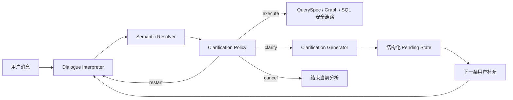

# Clarification Policy 实施设计

## Goal

为 Compound Data Agent Upgrade 的 Phase 2 定义可实施的确定性澄清策略：由对话解释器提取结构化候选和会话动作，由 Policy 基于缺失信息、互斥语义与不可映射过滤值决定是否澄清，由对话模型仅负责把结构化缺口表达为自然追问。

## Scope

- 盘点 `AgentService`、`followup_resolver`、`question_intent_parser`、conversation schema、Graph 和关联测试的现有澄清边界。
- 定义 `missing`、`conflict`、`action`、澄清决策和 pending state 的兼容数据契约。
- 给出最小接入顺序、自然语言追问边界、测试矩阵、评测指标和迁移风险。

## Out Of Scope

- 不修改共享运行代码、API、数据库 migration、前端、模型路由或 SQL 安全链路。
- 不新增固定业务指标列表、固定销售话术或固定 SQL。
- 不实现 Trusted SQL、Query Plan、Inspector、Result Contract 或后续阶段功能。

## Implementation Steps

- [x] 阅读 handoff、总计划、升级草案和 Semantic Resolver 接入设计。
- [x] 阅读澄清解析、会话续问、状态 schema、AgentService、Graph 和现有测试。
- [x] 定义结构化 Clarification Decision、pending 状态和最小接入方案。
- [x] 定义回归测试和 authenticated evaluation 扩展项。
- [ ] 主线按本设计实现 Phase 2，并完成独立验证、模块记录、提交和推送。

## Validation Plan

- 设计阶段：核对本文引用的模块、函数、字段和命令均存在，所有中文文件以 UTF-8 读取。
- 实施阶段：`backend/tests/test_question_intent_parser.py`、`backend/tests/test_conversation_service.py`、新增 `test_clarification_policy.py`、`test_analysis_graph_sql_selection.py`。
- 集成阶段：`npm.cmd run backend:test`、`npm.cmd run frontend:build`、authenticated `npm.cmd run eval:standard` 与 `npm.cmd run eval:database-baseline`；新增澄清精确率、召回率和不必要澄清率对照。

## Risks

- 当前 pending schema 仅支持 `metrics` / `time_range`，直接替换会破坏已持久化会话；首版必须向后兼容并提供状态升级逻辑。
- 云端对话模型输出不稳定，Policy 不能信任模型直接给出的 `needs_clarification` 作为最终决定。
- 澄清生成若含业务固定文案会重新引入过度约束；必须传入结构化原因和最小上下文，而非硬编码候选答案。
- 多 agent 并行时该文档只定义接口，核心 schema 与 AgentService 修改应由主线统一集成。

## Current-State Findings

当前流程中的澄清决策有三个来源，且没有统一所有权：

1. `question_intent_parser.py` 的模型输出直接包含 `needs_clarification` 和自然语言 `clarification`；模型失败后的 heuristic 又以 `CONFIDENCE_THRESHOLD` 决定该布尔值。
2. `followup_resolver.py` 以 `metrics`、`time_range` 两个硬编码槽位拼接补充问题，并用取消/否定关键词分支处理会话动作。
3. `AgentService.analyze()` 在 Semantic Resolver 之后直接检查 `intent.needs_clarification`；`analysis_graph.run_analysis_graph()` 也保留同一检查。

这使“是否该问”与“怎么问”混在 parser 中，且 pending state 无法表达契约冲突、过滤值不可映射、用户修改目标缺失等情形。`conversation_states.state` 是 JSONB，`ConversationState` 可通过 Pydantic 默认值读取历史记录，因此首期不需要数据库 migration；但新字段必须默认兼容历史的 `missing_slots`。

## Target Data Flow



`Dialogue Interpreter` 负责理解自然语言，不负责最终拦截；`Semantic Resolver` 只提供契约绑定、冲突和过滤值映射事实；`Clarification Policy` 是纯函数；`Clarification Generator` 只在 Policy 已决定 `clarify` 时调用云端对话模型。SQL Generator、QuerySpec、Guard 和只读 Executor 的安全边界不变。

## Structured Contract

建议新增 `backend/app/schemas/clarification.py`，并由 `ParsedQuestionIntent`、`PendingClarification` 引用。字段名以下列 Python/Pydantic 形式实现，所有枚举值为稳定的英文 code，用户可见文案不持久化为规则。

```python
class ConversationAction(str, Enum):
    NEW = "new"
    CONTINUE = "continue"
    MODIFY = "modify"
    CANCEL = "cancel"

class ClarificationAction(str, Enum):
    EXECUTE = "execute"
    CLARIFY = "clarify"
    CANCEL = "cancel"
    RESTART = "restart"

class MissingRequirement(BaseModel):
    code: str              # 例如 metric_or_entity、modification_target
    subject: str | None = None
    required_for: str      # aggregate、comparison、modify 等
    source: Literal["policy", "semantic_contract", "value_mapping"]

class SemanticConflict(BaseModel):
    code: str              # multiple_metric_contracts、ambiguous_filter_value 等
    subject: str | None = None
    candidates: list[str] = Field(default_factory=list)  # 仅 contract ID 或安全显示名
    source: Literal["semantic_contract", "value_mapping", "conversation"]

class ClarificationDecision(BaseModel):
    action: ClarificationAction
    missing: list[MissingRequirement] = Field(default_factory=list)
    conflicts: list[SemanticConflict] = Field(default_factory=list)
    conversation_action: ConversationAction
    reason_codes: list[str] = Field(default_factory=list)
```

`ParsedQuestionIntent` 增加 `conversation_action`、`ambiguities`（模型候选，非最终事实）与 `clarification_decision`；保留既有 `needs_clarification`、`clarification` 作为过渡兼容字段。Policy 写入时：`needs_clarification = decision.action == "clarify"`。`clarification_reason` 应由 `reason_codes` 替代，避免单一自由文本成为控制逻辑。

`PendingClarification` 增加可选 `decision: ClarificationDecision | None`、`clarification_attempts: int = 0`、`last_user_question: str = ""`；将 `missing_slots` 放宽为 `list[str]`，仅作为旧 Redis/JSONB 状态和旧客户端测试的投影。新状态以 `decision.missing[].code` 为真源。旧记录没有 `decision` 时，在第一次续问前由兼容适配器把 `missing_slots` 转为 `MissingRequirement`，不应丢弃会话。

## Interpreter And Policy Responsibilities

### Dialogue Interpreter

更新 `_system_prompt()` / `_user_prompt()` 的 JSON 协议，输出以下候选而不是最终业务拦截结论：

```json
{
  "original_question": "",
  "normalized_question": "",
  "intent_type": "aggregate|trend|ranking|comparison|detail|diagnostic",
  "metric_candidates": [],
  "entity_candidates": [],
  "dimension_candidates": [],
  "filters": [],
  "time_range": "",
  "ambiguities": [],
  "missing_candidates": [],
  "conversation_action": "new|continue|modify|cancel",
  "confidence": 0.0
}
```

- `confidence` 只能用于观测与模型回退，不能单独触发澄清。
- 未映射的完整指标/实体必须留在自然语言 candidate，继续交给 Resolver、检索和 SQL 生成。
- `missing_candidates` 和 `ambiguities` 是模型诊断，Policy 只在其与结构化事实相符时采用。
- 不再要求模型生成 `needs_clarification` 或 `clarification`。为兼容 provider 的旧响应，可读取这两个字段为 advisory，但不得直接使用为决定。

### Clarification Policy

新增纯业务服务 `backend/app/services/clarification_policy.py`：

```python
def decide_clarification(
    intent: ParsedQuestionIntent,
    resolution: SemanticResolution | None,
    pending: PendingClarification | None = None,
) -> ClarificationDecision: ...
```

决策优先级必须固定：

1. `conversation_action == cancel` 返回 `cancel`，不调用 SQL、检索或澄清生成。
2. 已有 pending 而用户表达独立的新问题，或 `modify` 已给出可解析修改目标，返回 `restart`，清空旧 pending 后重新解析完整问题。
3. `modify` 但没有可解析目标，返回 `clarify`，缺口为 `modification_target`。
4. Semantic Resolver 返回会改变结果的同等级契约冲突、或过滤值无法映射到可用值，返回 `clarify`，写入对应 `conflicts`。
5. 问题没有可执行业务对象/指标，且没有完整自然语言 entity/metric candidate，返回 `clarify`，缺口为 `metric_or_entity`。
6. 仅当已绑定语义契约/QuerySpec 明确把某个字段声明为 required，且用户未提供时，返回 `clarify`。时间是否必填由契约的 `time_semantics`、分析类型和用户显式比较请求决定；快照指标无时间不能澄清。
7. 其余返回 `execute`，包括低置信度、未命中词表、未命中契约但语义完整、没有时间范围的快照查询，以及用户未确认模型推断的完整问题。

Policy 不得使用销售额、订单、用户等固定业务列表判断缺失；只消费候选是否存在、QuerySpec、Semantic Resolution 和契约元数据。对于当前尚未实现的 value mapping，Policy 只接受 Resolver 已明确返回的不可映射事实，不能根据自由文本猜测冲突。

### Clarification Generator

新增 `backend/app/services/clarification_generator.py`（或以同名私有函数置于 Policy service），只接收：原始问题、最近必要会话轮次、`ClarificationDecision` 的 code/安全候选和已解析事实。它调用当前云端对话模型生成一句自然追问。

```text
输入：原问题 + missing/conflicts + 已确认条件
输出：单一、自然、只要求补充会改变结果的信息的问题
禁止：编造候选指标、暴露 contract ID、复述内部 reason code、生成 SQL、把业务词表当固定选项
```

模型失败时使用不含业务建议的中性 fallback，例如“为保证查询口径准确，请补充必要信息后继续。”；并记录 `clarification_generation_failed`。该 fallback 不改变 `ClarificationDecision`。

## Minimal Integration

### `question_intent_parser.py`

- 扩展 `ParsedQuestionIntent` 与模型 JSON 解析，保留 `semantic_metrics` / `semantic_dimensions` 的开放世界行为。
- 让 `_heuristic_intent()` 产生候选与 `conversation_action`，但不以 `CONFIDENCE_THRESHOLD` 设置最终澄清；解析器可为兼容暂填 `needs_clarification=False`。
- 删除 `_clarification()` 对固定指标/维度的业务文案依赖。自然追问由 Generator 产生。

### `agent_service.py`

首轮及续问的唯一编排顺序应为：

1. 建立工作/长期记忆上下文，调用 Interpreter。
2. 调用 `apply_semantic_resolution(intent)`；Resolver 冲突转为结构化冲突，不直接生成文本。
3. 调用 `decide_clarification(intent, resolution, pending)`。
4. `cancel`：清空 pending、标记取消并返回既有取消响应。
5. `restart`：清空旧 pending，用新问题重新走第 1 步，避免旧槽位污染。
6. `clarify`：调用 Generator，创建结构化 pending，更新 working memory，并以现有 `AnalyzeResponse.pending_clarification=true` 返回。
7. `execute`：清空 pending，调用一次 `run_analysis_graph(..., parsed_intent=intent)`。

`analysis_graph.py` 保留直接调用时的防御性 `needs_clarification` 检查，但主链路不得绕过 Policy 直接依赖 parser 布尔值；实施时应在 Graph 入口对没有 `clarification_decision` 的 direct caller 补一次 Policy，防止 API 外调用产生不一致行为。

### Phase 1 Resolver Interface Adjustment

当前 `backend/app/tools/semantic_resolver.py` 的 `apply_semantic_resolution()` 会在冲突时直接写入 `needs_clarification=True` 和拼接后的 `clarification` 文本。Phase 2 必须将这个职责移除：保留 `SemanticResolution.contracts` / `conflicts` 原始事实，或把结构化 conflict 投影到 intent；由 `decide_clarification()` 统一将其转换为 `ClarificationDecision`。Resolver 不应决定会话动作、调用 Generator 或写用户可见文案。

最小兼容做法是新增返回 resolution 的入口，例如 `resolve_and_apply_semantic_resolution(intent) -> tuple[ParsedQuestionIntent, SemanticResolution]`；`apply_semantic_resolution()` 可保留为旧调用包装，但不得在 Phase 2 主链路中自行拦截。该调整由主线与 Phase 1 集成改动一起完成，避免 Policy 从 `semantic_conflicts: list[str]` 重新推断丢失的候选事实。

### `followup_resolver.py`

将 `resolve_followup()` 改为只负责结构化续问组合，不再通过 `_CANCEL_TOKENS`、`_REJECT_SUGGESTION_TOKENS` 或两个槽位自行决定最终文案。它必须：

- 使用 pending 的 `decision.missing` 构造最小会话上下文，并让 Interpreter 返回 `conversation_action`。
- 按缺口 code 合并已验证的 metric/entity/dimension/filter/time 字段；不得把用户回答原样拼进 canonical SQL 问题。
- 每次补充后重跑 Semantic Resolver 和 Clarification Policy，旧的 conflict/missing 不能永久沿用。
- 对 `cancel`、`new`、有目标的 `modify` 返回结构化 action；对仍缺信息返回更新后的 pending，由 Generator 重新生成追问。
- `clarification_attempts` 达到 2 且同一 reason code 无进展时停止自动循环，返回可操作的安全失败/重述提示，不进入 SQL。

### Persistence, API And Observability

- `ConversationRepository` 已序列化完整 Pydantic JSON，无 migration 即可存新嵌套字段；历史 JSON 通过 Pydantic defaults 和兼容适配器读取。
- `/api/analyze` 的外部字段保持兼容：`pending_clarification`、`conversation_status` 与自然语言 `summary` 不变。结构化 `ClarificationDecision` 首期仅保存到会话/运行日志，不暴露给普通用户。
- run/tool 日志只记录 action、reason code、missing count、conflict code、attempt 数、模型延迟；不记录完整会话、原始敏感过滤值、prompt 或密钥。

## Test Matrix

| 层级 | 场景 | 核心断言 |
| --- | --- | --- |
| Interpreter | 明确未知指标、低 confidence | 保留自然语言候选；Policy 为 `execute` |
| Interpreter | 模型旧字段 `needs_clarification=true` | 仅作为 advisory，不能覆盖明确候选 |
| Policy | 无实体/指标 | `clarify` + `metric_or_entity`，无固定业务候选文本 |
| Policy | 快照指标无时间 | `execute`，不因为未给时间澄清 |
| Policy | 契约 required 字段缺失 | `clarify` + 对应 missing code |
| Policy | 同等级 metric/filter value 冲突 | `clarify` + 结构化 conflict，不能任意选择 |
| Policy | `cancel`、无目标 `modify`、有目标 `modify` | 分别为 `cancel`、`clarify`、`restart` |
| Follow-up | 依次补齐多个缺口 | 每轮重算 decision，齐全后只执行一次 Graph |
| Follow-up | 否定旧建议 / 独立新问题 | 旧 pending 清除，不复读旧澄清文本 |
| Follow-up | 两次无进展 | 不无限追问，不进入 SQL |
| Persistence | 旧 `missing_slots` JSON | 可反序列化并升级为默认结构 |
| AgentService | 首轮 clarify / execute / cancel | 状态、历史、Graph 调用次数和用户可见字段正确 |
| Graph | 直接调用、Policy 已执行 | 不二次解析或生成不一致澄清 |
| Security | prompt injection、危险 SQL 输入 | Policy 不放宽 QuerySpec、Guard、只读 Executor |

建议新增 `backend/tests/test_clarification_policy.py`，使用纯 fake intent/resolution，不调用云端模型或数据库。更新 `test_question_intent_parser.py`、`test_conversation_service.py`、`test_analysis_graph_sql_selection.py` 与持久化测试；所有改动代码注释采用中文并说明业务规则或安全边界。

## Evaluation And Acceptance

扩展 eval JSONL 的可选字段（保持既有 case 兼容）：

```json
{
  "expected_conversation_action": "new",
  "expected_clarification_action": "execute",
  "expected_missing_codes": [],
  "expected_conflict_codes": []
}
```

新增小型版本化澄清集，至少覆盖明确可执行、真正缺失、多轮补齐、修改、否定、取消、契约冲突、不可映射值和模型不可用。报告新增：`clarification_precision`、`clarification_recall`、`unnecessary_clarification_rate`、平均澄清轮次和同一 reason 重复率。原有 `eval:standard`、`eval:database-baseline` 继续作为 SQL/答案质量回归，不把模型超时或鉴权错误计为 Policy 质量。

Phase 2 可验收的最小证据：明确问题不因低置信度/词表未命中/无时间快照而澄清；真正缺失或冲突问题有确定性 reason code；补充、修改、否定、取消不会复读旧文案或直接执行未经 Policy 判定的问题；安全边界和 authenticated baseline 无回退。

## Implementation Order

1. 先等待并接入 Phase 1 Resolver 的稳定 `SemanticResolution` 接口，确认 conflict/value mapping 字段。
2. 新增结构化 schema 与纯 Policy 单测，保持旧 pending JSON 可读。
3. 改造 parser 输出为解释器候选，接入 Policy 和 Generator。
4. 重写 follow-up 合并为 decision 驱动，统一由 AgentService 编排。
5. 补充 Graph 防御、日志与评测断言。
6. 运行 focused pytest、后端全量、前端构建、authenticated standard/database benchmark；记录前后澄清指标和答案匹配。
7. 创建模块记录，更新 handoff，按项目规范提交并推送后再进入 Trusted SQL Phase。
