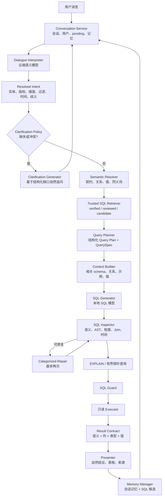

# 复合式数据分析 Agent 升级改造草案

> 状态：待审查。本文件只定义升级方案、阶段边界和验收指标，不授权修改业务代码、数据库结构或运行配置。

## Goal

将当前“意图模型 + 检索 + SQL 模型 + Guard + Executor”链路升级为可评估、可治理、可持续积累可信资产的复合式数据分析 Agent，重点解决：

1. 明确信息被误判为需要澄清。
2. 澄清回复固定、重复或无法结合当前会话。
3. 同一问题因模型波动生成不同 SQL，偶发进入 `503`。
4. SQL 语法正确但业务口径、Join、状态或时间范围错误。
5. 成功 SQL 被直接当成可信 SQL 复用，缺少人工验证等级。
6. 查询结果正确但 Presenter 使用错误业务文案。
7. 本机启用鉴权后标准评测无法运行，导致优化缺少可信基线。

目标不是消除所有模型不确定性，而是将不确定性限制在可观察、可修复、可降级的边界内。

## Scope

- 建立开放式语义层，管理实体、指标、维度、关系、状态值、时间语义和禁止推断。
- 将对话理解与澄清决策拆开：模型负责理解，确定性策略负责判断是否需要澄清，模型负责自然表达。
- 将 SQL Memory 升级为带审核状态的 Trusted SQL / Verified Query 资产。
- 增加结构化查询计划、独立 SQL Inspector、`EXPLAIN` 预检和分类 Repair。
- 改造 Presenter，使回答基于最终语义、结果列和真实值生成。
- 修复鉴权评测，建立单轮、多轮、语义、安全、故障和稳定性评测体系。
- 规划模型路由、可观测性、灰度发布和回滚机制。

## Out Of Scope

- 本草案阶段不修改业务代码、数据库 migration、API 和前端。
- 不允许模型直接执行 SQL，不放宽 QuerySpec、SQL Guard 或只读 Executor。
- 不把所有未知业务概念加入固定词表，也不为每个失败问题增加固定 SQL。
- 不自动把一次执行成功的 SQL 标记为 verified。
- 不在本轮实施模型微调、并发 Agent、多线程、OAuth、MFA 或多租户组织模型。
- 不支持 DML、DDL 或任意数据库写操作。

## Implementation Steps

- [x] 调研成熟数据库分析 Agent 的公开架构与质量机制。
- [x] 对照当前项目的意图、记忆、检索、SQL、Guard、Presenter 和评测边界。
- [x] 形成目标架构、模块设计、阶段顺序、质量门槛和风险清单。
- [ ] 用户审查并确认草案末尾的关键决策问题。
- [ ] 为 Phase 0 单独创建实施计划并恢复 authenticated evaluation。
- [ ] Phase 0 验收后，再按独立模块推进 Semantic Layer V2、Clarification Policy 和 Trusted SQL。
- [ ] 后续阶段分别建立计划、测试、完成记录、commit 和 push，不跨阶段一次性交付。

## Market Pattern Extraction

本草案吸收以下成熟系统的共同机制：

| 系统 | 采用机制 | 本项目落位 |
|---|---|---|
| Snowflake Cortex Analyst | Semantic View、Verified Query Repository、多轮消息历史、模型路由、评估 | Semantic Contract、Trusted SQL、Conversation State、模型路由、离线评测 |
| Databricks Genie | Compound AI、Knowledge Store、Trusted Assets、Prompt Matching、Inspect、小 SQL 验证、自动重试 | 语义知识库、受信 SQL/函数、实体值匹配、SQL Inspector、探针查询、分类 Repair |
| LangChain SQL Agent | 表/schema 工具、Query Checker、数据库错误反馈循环、人工审批 | 任务化 Context Builder、独立检查器、执行错误分类、可选人工审核 |
| Wren AI | MDL 语义层、AI Service 与 Core 分离、SQL 验证 | 语义层与生成层分离、Planner/Inspector/Executor 明确边界 |
| Vanna | Tool Memory、相似 SQL 复用、成功交互积累 | SQL Memory 分级、相似 verified SQL 检索、成功候选待审核 |

## Design Principles

1. **语义资产优先于 Prompt 特例**：稳定业务事实进入语义层，不散落在系统提示词和正则中。
2. **开放世界而非封闭词表**：已知概念走受控契约；未知但明确的概念继续检索和模型生成；只有真正缺失或冲突才澄清。
3. **澄清由缺失槽位驱动**：模型置信度是诊断信息，不直接等同于 `needs_clarification`。
4. **生成与检查分离**：SQL Generator 不能自我证明正确；Inspector、AST 校验、`EXPLAIN` 和 Guard 独立执行。
5. **执行成功不等于业务正确**：成功 SQL 只能成为候选，经过审核和回归后才能成为 Trusted SQL。
6. **结构化状态优先**：会话续接、QuerySpec、语义契约和 Repair 原因均使用结构化对象，不依赖原始文本拼接。
7. **最小必要上下文**：不同模型只接收完成任务所需的最小上下文；不把完整聊天、全部 schema 和内部日志无差别发送。
8. **安全边界不可降级**：任何模型、Memory 或 Trusted SQL 最终都必须经过 Guard 和只读 Executor。
9. **评估驱动发布**：没有可重复的 authenticated benchmark，不进入下一阶段生产化。

## Target Architecture



## Module 1: Semantic Layer V2

### Purpose

把“用户、订单、销售额、支付成功、当前、最近一个月”等业务知识从 Prompt 中抽离为版本化资产，使模型面对的是明确业务契约，而不是裸表结构。

### Semantic Contract

建议统一内部契约：

```json
{
  "contract_id": "user_total",
  "kind": "metric",
  "display_name": "用户总数",
  "synonyms": ["总用户数", "当前用户数", "累计用户"],
  "entity": "user",
  "definition": "当前可见用户实体的去重总量",
  "grain": "user",
  "aggregation": "count_distinct",
  "source_tables": ["users"],
  "required_fields": ["users.id"],
  "default_filters": [],
  "forbidden_inferences": ["新增用户", "下单用户", "已支付", "最近一天"],
  "time_semantics": "snapshot",
  "owner": "data-team",
  "version": 1,
  "status": "active"
}
```

### Asset Types

- `entity`：用户、订单、商品、支付、退款、优惠券、流量事件。
- `metric`：用户总数、销售额、订单数、客单价、退款率、转化率。
- `dimension`：日期、月份、城市、品类、支付方式、来源。
- `relationship`：Join 字段、基数、方向、可信来源、可选条件。
- `value_semantics`：`FL = Florida`、状态枚举、业务别名和格式。
- `policy`：默认过滤、禁止推断、隐私字段、可见范围。

### Open-World Resolution

```text
已知且唯一契约        -> 绑定契约，继续 Planner
已知但多个契约冲突    -> 针对冲突项澄清
未知但语义完整        -> 保留 semantic candidate，检索 schema 后进入生成
未知且缺少业务对象    -> 澄清业务对象或指标
```

禁止使用“是否进入预置词表”作为唯一澄清条件。

## Module 2: Dialogue Interpreter And Clarification Policy

### Interpreter Output

云端对话模型统一输出：

```json
{
  "original_question": "",
  "canonical_question": "",
  "intent_type": "aggregate|trend|ranking|comparison|detail|diagnostic",
  "entity_candidates": [],
  "metric_candidates": [],
  "dimension_candidates": [],
  "filters": [],
  "time_range": null,
  "ambiguities": [],
  "missing_slots": [],
  "user_corrections": [],
  "conversation_action": "new|continue|modify|cancel",
  "confidence": 0.0
}
```

### Clarification Decision

确定性策略：

```text
needs_clarification =
    missing_required_slots 非空
    或存在会改变查询结果的互斥语义契约
    或过滤值无法映射到数据库可用值
    或用户明确要求修改但没有提供修改目标
```

以下情况不得仅因低 confidence 而澄清：

- 已有明确实体和度量。
- 未命中标准 metric ID，但模型保留了完整自然语言候选。
- 没有指定时间，但该指标允许全量快照。
- 用户没有确认模型建议，但原问题本身已经完整。

### Natural Clarification

Clarification Policy 只输出结构化缺口，例如：

```json
{
  "reason": "multiple_metric_contracts",
  "missing_slots": [],
  "conflicts": ["注册用户总数", "活跃用户总数"]
}
```

同一个云端对话模型根据该结构和最近会话生成自然问题。代码不得拼接固定销售指标列表。

## Module 3: Trusted SQL And Verified Query Repository

### SQL Memory Status

建议将现有 `sql_memories` 扩展为：

```text
candidate   -> 模型生成但未执行
executed    -> Guard 通过且执行成功
reviewed    -> 人工检查 SQL 和结果
verified    -> 绑定语义契约版本并通过回归
deprecated  -> schema/契约变化后停用
rejected    -> 业务口径错误或不应复用
```

### Reuse Policy

- `verified`：允许参数化 fast path，但仍经过 QuerySpec 校验和 Guard。
- `reviewed`：可作为高权重 few-shot，不直接复用。
- `executed`：仅作为低权重候选，不得直接 fast path。
- `candidate`：只用于开发者审核。
- 契约版本、schema hash 或权限范围变化后自动降级为 `reviewed` 或 `deprecated`。

### Trusted Asset

复杂且稳定的业务逻辑可以升级为参数化 SQL 或只读数据库函数，例如复购率、漏斗转化、财务期间。模型只负责选择资产和填入经过类型校验的参数，不改写内部公式。

## Module 4: Context Builder And Prompt Matching

### Context Pack

为每次 SQL 生成构造最小上下文：

```json
{
  "resolved_intent": {},
  "semantic_contracts": [],
  "allowed_tables": [],
  "schema_fields": [],
  "join_relationships": [],
  "representative_values": [],
  "trusted_examples": [],
  "forbidden_inferences": [],
  "query_plan": {}
}
```

### Retrieval Order

1. 语义契约精确匹配和同义词匹配。
2. 实体、指标、维度 embedding 粗召回。
3. QuerySpec 与表/字段/关系规则重排。
4. 检索相似 verified SQL。
5. 仅对相关枚举字段提供代表值或 entity matching。
6. 隐藏无关、重复、敏感或容易误导模型的字段。

不得把完整 schema、全部 SQL Memory 和全部业务词表一次性传给模型。

## Module 5: Query Planner And SQL Generator

### Query Plan

SQL 生成前先得到结构化计划：

```json
{
  "entities": ["user"],
  "measures": [{"operation": "count_distinct", "field": "users.id", "alias": "user_count"}],
  "dimensions": [],
  "joins": [],
  "filters": [],
  "time_filter": null,
  "order_by": [],
  "limit": 1,
  "expected_shape": {"row_count": "single", "columns": ["user_count"]}
}
```

Query Plan 由 Semantic Resolver 和 Planner 产生，SQL 模型不能自由改变指标、Join、过滤和时间语义。

### Model Routing

建议默认：

- 对话理解与澄清：当前云端模型。
- SQL 生成：本地 7B 级代码/SQL 模型，4-bit 量化；3B 保留为快速简单任务或降级模型。
- SQL Inspector：优先确定性 AST/规则；复杂语义检查可调用独立模型。
- 摘要与 Presenter：云端对话模型或轻量本地模型，根据隐私和延迟配置。

模型路由必须记录 provider、model、prompt version、latency 和 failure category，不记录密钥和完整敏感 prompt。

## Module 6: SQL Inspector, Explain And Repair

### Inspection Layers

1. **AST 结构检查**：只读、单语句、表/字段、聚合、GROUP BY、LIMIT、危险函数。
2. **Query Plan 对齐**：实体、指标、维度、Join、过滤、时间、排序和输出形态。
3. **粒度检查**：一对多 Join 后的重复聚合、去重主键和分母粒度。
4. **值检查**：状态值、枚举、日期边界和类型。
5. **`EXPLAIN (FORMAT JSON)`**：语法、对象、Join 计划和潜在全表扫描诊断，不返回业务数据。
6. **有界探针查询**：只对允许场景验证过滤值、日期窗口、Join 基数或聚合分母；必须只读、超时、LIMIT 和脱敏。

### Categorized Repair

```text
missing_table / missing_column -> 重新检索 schema
invalid_join                    -> 注入 verified relationship
invalid_value                   -> entity/value matching
time_range                      -> 重建 [start, end) 条件
wrong_metric                    -> 回到 Semantic Contract / Query Plan
duplicate_aggregation           -> 修正 grain 或预聚合
syntax / group_by / type_cast   -> SQL 级修复
unsafe                          -> 不修复，直接阻断
```

最多两次 Repair；同一错误连续出现两次立即停止。Repair 后必须重新经过完整 Inspector、Guard 和 Executor，不能只检查错误字符串是否消失。

## Module 7: Result Contract And Presenter

### Result Contract

```json
{
  "resolved_question": "当前用户总数是多少？",
  "semantic_contracts": ["user_total@v1"],
  "query_plan": {},
  "sql": "",
  "columns": [{"name": "user_count", "semantic_role": "metric", "format": "integer"}],
  "rows": [],
  "row_count": 1,
  "time_range": null,
  "warnings": [],
  "provenance": {}
}
```

Presenter 必须基于 Result Contract 生成回答，禁止根据通用销售模板猜测主题。单值、趋势、排行、明细和对比使用不同呈现策略。

用户可见回答包括：

- 直接结论。
- 必要的口径和时间范围。
- 简洁结果表或图表。
- SQL 和数据来源。
- 安全失败时的可操作说明。

普通用户不展示模型 provider、Prompt、向量分数、内部 Repair 文本和数据库原始错误。

## Module 8: Evaluation And Quality Gates

### Evaluation Sets

- 单轮明确问题。
- 真正模糊问题与应澄清问题。
- 不应澄清问题。
- 多轮补充、修改、否定、取消和新问题切换。
- 指标口径、Join、时间、状态、枚举和聚合粒度。
- SQL 注入、危险函数、超大 LIMIT 和权限隔离。
- 模型超时、Redis 不可用、embedding 不可用和数据库错误。
- SQL Memory 误复用、契约版本变化和 schema 漂移。
- 同一问题重复运行稳定性。

### Metrics

- `clarification_precision`：发起澄清中真正需要澄清的比例。
- `clarification_recall`：需要澄清的问题被正确拦截的比例。
- `unnecessary_clarification_rate`。
- `first_pass_sql_valid_rate`。
- `repair_success_rate`。
- `execution_success_rate`。
- `semantic_strict_success_rate`。
- `verified_query_reuse_accuracy`。
- `guard_block_recall` 与 `unsafe_execution_count`。
- P50/P95 延迟、模型调用次数和成本。
- 同题 N 次运行的 SQL/结果稳定率。

### Quality Gates

进入生产候选前建议达到：

- authenticated eval runner 全链路可运行。
- 明确问题不必要澄清率 `< 2%`。
- 标准问题执行成功率 `>= 90%`。
- V1 严格语义成功率从当前约 `55%-60%` 提升到 `>= 80%`。
- verified domain 问题严格成功率 `>= 95%`。
- 危险 SQL 执行数为 `0`。
- 已知关键问题连续运行 20 次，Guard 后成功率 `>= 95%`。

## Module 9: Observability And Governance

每次运行记录：

- conversation/turn/run correlation id。
- Resolved Intent、绑定契约 ID 和版本。
- clarification reason、missing slots 和 conflicts。
- Context Pack 摘要与命中 Trusted Asset。
- Query Plan、生成路径、Inspector 类别和 Repair 次数。
- Guard、`EXPLAIN`、Executor 和 Presenter 状态。
- provider/model/prompt version/latency/token usage。
- 最终人工反馈与 SQL Memory 状态变化。

不得记录 API key、完整用户敏感数据、未脱敏样本值和普通用户不可见的数据库原始错误。

## Data Model Draft

优先复用现有表，仅在缺少明确所有权时新增结构：

| 资产 | 建议落位 |
|---|---|
| 实体、指标、维度契约 | 扩展 `metric_definitions`，或新增统一 `semantic_contracts` |
| 字段业务含义与敏感标记 | 扩展 `schema_metadata` |
| Join 关系 | 新增 `semantic_relationships` 或持久化当前关系推断结果 |
| 枚举值与同义词 | 新增 `semantic_value_mappings`，不保存敏感自由文本 |
| Trusted SQL | 扩展 `sql_memories` 状态、审核、契约版本和 schema hash |
| Benchmarks | 继续使用 `eval/datasets`，数据库只保存运行结果和版本 |
| 模型/Prompt 版本 | `query_runs` 和 `tool_calls` 增加摘要字段 |

所有 migration 在实施阶段单独设计；本草案不确定最终表名。

## Phased Delivery

### Phase 0: Restore Measurement

- 修复 authenticated eval runner。
- 固化当前 20 case、澄清、多轮和失败恢复基线。
- 更新过期架构文档，确保文档与代码事实一致。
- 输出失败分类报告，而不是只看成功率。

验收：本机 `AUTH_REQUIRED=true` 时标准评测可重复运行，不修改真实用户会话。

### Phase 1: Semantic Layer V2

- 定义 Semantic Contract schema 和 repository。
- 迁移现有 metric definitions、schema descriptions 和关系。
- 实现开放式 Semantic Resolver 和禁止推断规则。

验收：用户总数、注册用户、下单用户能稳定区分；未知明确指标不被词表阻断。

### Phase 2: Clarification Policy

- 引入 Resolved Intent 和确定性 Clarification Policy。
- Follow-up Resolver 使用结构化 action/missing/conflict。
- 删除剩余业务固定澄清文案。

验收：明确问题直接执行；模糊问题定向追问；修改/否定不会复读。

### Phase 3: Trusted SQL Repository

- 扩展 SQL Memory 状态和审核接口。
- 仅 verified SQL 允许 fast path。
- 为关键业务问题建立首批参数化 verified queries。

验收：错误成功 SQL 不再直接污染 fast path；契约变更可使旧 SQL 自动失效。

### Phase 4: Query Plan And Context Pack

- 在 SQL 前生成结构化 Query Plan。
- 重构 Context Builder，按语义契约和计划裁剪 schema。
- 加入代表值和 entity matching。

验收：SQL Prompt 不携带无关表；状态值、Join 和时间语义命中率提升。

### Phase 5: Inspector And Repair

- 独立 AST/语义 Inspector。
- `EXPLAIN` 预检和受控探针查询。
- 分类 Repair、重复错误熔断和最多两次重试。

验收：错误支付状态、Join、时间和重复聚合在执行前被修复或安全阻断。

### Phase 6: Presenter And User Trust

- 引入 Result Contract。
- 改造单值、趋势、排行、对比和明细 Presenter。
- 前端展示准确口径、范围、来源和失败建议。

验收：用户总数不再显示销售趋势；失败信息与实际失败阶段一致。

### Phase 7: Model Upgrade And Routing

- 使用评测对比本地 3B、7B 4-bit 和可选云端 SQL 模型。
- 依据问题复杂度路由模型。
- 评估延迟、显存、准确率、隐私和成本。

验收：选择结果必须由 benchmark 支撑，不以单个截图或主观体验决定。

## Recommended Priority

下一轮建议只实施 Phase 0，不直接开始模型升级或 Semantic Layer migration。原因：当前 authenticated eval 不可用，无法证明后续改造是否真正提高质量，也无法稳定比较 3B、7B 和云端 SQL 模型。

Phase 0 完成后建议顺序：

```text
Semantic Layer V2
-> Clarification Policy
-> Trusted SQL
-> Query Plan / Context Pack
-> Inspector / Repair
-> Presenter
-> Model Routing
```

## Validation Plan

本草案为文档交付，当前验证范围：

- 与 `docs/architecture.md`、`docs/agent_workflow.md`、`docs/evaluation.md` 和 memory draft 对照。
- 确认不建议绕过 QuerySpec、Guard、只读 Executor 和会话所有权。
- 确认阶段均可独立建立计划、测试、模块记录、commit 和 push。
- 用户审查通过后，为 Phase 0 单独创建实施计划；不得直接把本草案视为 migration 或 API 变更授权。

## Risks

- 语义层治理需要业务负责人参与；技术团队不能自行决定所有指标口径。
- Verified Query 过多或相互冲突会降低模型稳定性，必须有 owner、版本和回归。
- Inspector 和探针查询会增加延迟，必须设置预算、超时和复杂度门槛。
- 本地 7B 模型在 8GB 显存上需要量化和实测，不能假设所有模型都能稳定运行。
- 云端 SQL 模型会涉及 schema、字段说明和可能的样本值出域，需要单独隐私评审。
- 多层资产增加运维复杂度，必须先建立评测、可观测和回滚机制。

## Review Questions

用户审查时需要确认：

1. 是否接受“只有 verified SQL 才能 fast path”，即牺牲部分命中率换取准确性。
2. 是否接受新增语义契约管理能力，以及由谁维护指标 owner 和版本。
3. SQL 生成是否必须完全本地，还是允许只发送脱敏 schema/语义契约到云端模型。
4. 是否接受 `EXPLAIN` 和有限探针查询带来的额外延迟。
5. Phase 0 是否同时修复评测鉴权和清理过期架构文档。
6. 首批 verified domain 选择用户、订单、销售、支付还是全部 V1 20 个问题。
