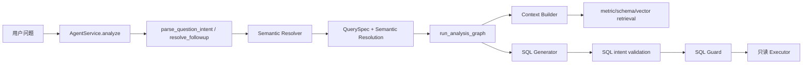

# Semantic Resolver 集成设计

## Goal

为 Compound Data Agent Upgrade 的 Phase 1 定义开放式 Semantic Resolver 的最小接入方案：把版本化 Semantic Contract 解析为结构化语义绑定，增强检索、SQL 生成与意图校验，同时保留未知但明确问题的开放检索/模型生成路径。

## Scope

- 盘点 `question_intent_parser`、会话续问、`QuerySpec`、`context_builder`、`analysis_graph` 和 SQL generator 的数据边界。
- 定义 Resolver 输入输出、匹配优先级、冲突与开放世界降级规则。
- 定义主线实施接入点、测试矩阵、日志字段与迁移依赖。

## Out Of Scope

- 不修改共享运行代码、migration、API、前端或 SQL 安全链路。
- 不替换对话模型，不新增固定 SQL，不因契约未命中而强制澄清。
- 不实现 Trusted SQL、Inspector、EXPLAIN、Result Contract 或模型路由后续阶段。

## Implementation Steps

- [x] 阅读 handoff、总计划和升级草案。
- [x] 阅读意图、QuerySpec、会话续问、检索、Graph、SQL generator 与现有测试。
- [x] 定义最小数据流、具体接入点、测试清单和风险。
- [ ] 主线依据 Semantic Contract 数据基础层最终公开接口实现 Resolver。

## Validation Plan

- 设计阶段：以 UTF-8 核对本文件的路径、函数名和数据流。
- 实施阶段：`test_semantic_resolver.py`、`test_question_intent_parser.py`、`test_query_spec.py`、`test_retrieval_tools.py`、`test_analysis_graph_sql_selection.py`。
- 集成阶段：`npm.cmd run backend:test`、authenticated `npm.cmd run eval:standard`、`npm.cmd run eval:database-baseline`，比较澄清率和答案匹配率。

## Risks

- Semantic Contract 数据基础层并行开发，repository 方法及 schema 字段必须以其交付为准。
- 与既有 `metric_definitions` 并存时有重复召回风险，首版只把新契约作为显式绑定与上下文增强，不移除现有 retriever。
- 契约错误会造成系统性口径错误，Resolver 只能消费 active 契约，冲突必须显式输出。
- SQL 模型仍不可信，语义绑定只能约束上下文和校验，最终 SQL 仍必须通过 Guard 与只读 Executor。

## Current And Target Data Flow



当前意图模型已经保留 `semantic_metrics` / `semantic_dimensions`，未知但完整候选可继续进入 SQL prompt；但稳定业务知识仍分散在 `question_intent_parser.py`、`query_spec.py` 常量和 `metric_definitions` 召回中。Resolver 需要将新表 `semantic_contracts` 的版本、同义词、表字段、默认过滤和禁止推断以结构化方式附加到现有 intent，而不是重做意图识别。

## Resolver Contract

新增业务层模块建议为 `backend/app/services/semantic_resolver.py`，不调用模型、不生成 SQL。

```python
SemanticResolveRequest(
    original_question: str,
    normalized_question: str,
    metric_candidates: list[str],
    dimension_candidates: list[str],
    filters: list[str],
    query_spec: QuerySpec,
)

SemanticResolution(
    matched_contracts: list[ResolvedSemanticContract],
    unresolved_candidates: list[str],
    conflicts: list[SemanticConflict],
    allowed_tables: list[str],
    required_fields: list[str],
    default_filters: list[SemanticFilter],
    forbidden_inferences: list[str],
    contract_versions: dict[str, int],
)
```

`ResolvedSemanticContract` 至少保留 `contract_id`、`kind`、`display_name`、`version`、`source_tables`、`required_fields`、`default_filters` 与 `forbidden_inferences`。日志只能记录 ID、版本和数量，不能记录完整会话、审核备注或敏感过滤值。

## Resolution Rules

1. 仅读取 `active` 的当前契约版本。
2. 精确 `contract_id` / 标准名称优先，其次规范化同义词精确匹配，最后才是有阈值的语义候选匹配。
3. 唯一命中写入 `matched_contracts`；同等级多命中写入 `conflicts`，不得任意选择。
4. 未命中而问题完整时写入 `unresolved_candidates` 并继续现有 schema/vector/模型路径，保持不澄清。
5. 只有实质性契约冲突、无法映射的过滤值或真正缺失实体/度量时，Clarification Policy 才澄清；低 confidence、词表未命中或契约未命中都不是理由。
6. `default_filters` 仅对已绑定契约生效，不得覆盖用户显式过滤；`forbidden_inferences` 同时进入 SQL prompt 和意图校验。

## Concrete Integration Points

### `backend/app/services/agent_service.py`

在 `parse_question_intent(...)` 或 `resolve_followup(...)` 后、`intent.needs_clarification` 检查前调用 Resolver。此时首轮和补充轮已经具备合并后的 `QuerySpec` 与会话上下文。把 resolution 写入 intent；follow-up 必须重算 resolution，不能沿用旧版本。

首期保留 parser 当前的明确澄清结论，只额外防止“唯一契约已绑定却因候选未命中而澄清”的路径。不要在 Graph 内二次解析意图。

### `backend/app/tools/question_intent_parser.py` / `backend/app/services/followup_resolver.py`

继续由 parser 的云端模型提取自然语言候选，继续由 `build_query_spec` 维护既有受控指标、时间半开区间和 SQL 约束。不要在 parser 查询数据库。建议提供 `apply_semantic_resolution(intent, resolution)`：已绑定契约补齐受控 ID/表字段/禁止推断，未知候选继续保留在 `semantic_metrics`/`semantic_dimensions`。

### `backend/app/agents/analysis_graph.py`

扩展 `AnalysisGraphState` 的可选 `semantic_resolution`，由 `run_analysis_graph(... parsed_intent=intent)` 初始写入。`_retrieve_context_node` 将 resolution 传给 Context Builder。`_plan_memory_reuse_node` 用 QuerySpec required tables 与 resolution 所需表字段并集，但不能降低原有 QuerySpec 约束。

`_sql_intent_required()` 应在保留现有 QuerySpec 校验的基础上增加契约 required fields、default filters 和 forbidden inference 断言。只产生现有 reject/repair 信号，绝不绕过 Guard。

### `backend/app/tools/context_builder.py`

将 `build_retrieval_context(question)` 演进为兼容可选参数 `semantic_resolution=None`：

- 已绑定时提升 source tables / required fields 的 rerank 优先级，并在 `RetrievalContext` 增加最小 `semantic_contracts` 摘要。
- 未绑定时不改变当前 topic/vector retrieval，不能因没有契约排除可用 schema。
- 只向模型提供 ID、版本、定义、表字段、默认过滤和禁止推断，不暴露审核内部信息。

### `backend/app/tools/model_sql_generator.py`

在已有 compact `question_intent` payload 中加入 `semantic_resolution` 摘要。提示词约束：绑定契约不得改变 grain、required fields、filters 或 forbidden inferences；未知候选允许在已有 schema 中正常生成。模型输出仍会经过 `_verify_generated_sql_intent`、Guard 和 Executor。

### 运行日志与评测

`_log_run_node` / `RunService` 记录 matched IDs、versions、unresolved count、conflict codes 和 context tables。评测 case 可选增加 `expected_contract_ids`、`expected_no_clarification`、`expected_conflict`，并保持现有 JSONL 兼容。

## Test Matrix

| 层级 | 场景 | 断言 |
| --- | --- | --- |
| Resolver | 标准名、同义词、inactive、版本 | 仅 active 最新版本；输出 ID/version/表字段 |
| Resolver | 唯一、冲突、未知完整候选 | 唯一不澄清；冲突有 code；未知不强制澄清 |
| Follow-up | 首轮 + 补充时间/指标 | 合并后重算 resolution，不沿用旧 contract version |
| QuerySpec | 绑定与既有受控指标 | required tables 和半开时间范围不回退；显式过滤优先 |
| Retrieval | 有契约 / 无契约 | 有契约表字段优先；无契约继续 vector/topic retrieval |
| Graph | forbidden inference、缺字段 | SQL reject 后沿用现有 repair，Guard 边界不变 |
| Prompt | 已知 / 未知候选 | 最小 summary 已传入，未知候选未删除 |
| Observability | run/tool summary | 仅 ID/version/count，不含敏感内容 |
| Eval | 50 case + 多轮 | contract、无需澄清、答案匹配可分别统计 |

## Integration Order

1. 等待 `semantic_contracts` migration、schema、repository 模块确认公开接口。
2. 实现纯 Resolver 及 fake repository 单测。
3. 在 `AgentService` 首轮和续问统一接入，并为 intent 增加可选 resolution。
4. 透传到 Context Builder、Graph、SQL payload 和意图校验。
5. 增加 observability/eval 断言，运行 authenticated baseline；确认澄清率与答案匹配无回退。
6. 独立验证、模块文档、handoff、commit/push 后，再进入 Clarification Policy Phase 2。
