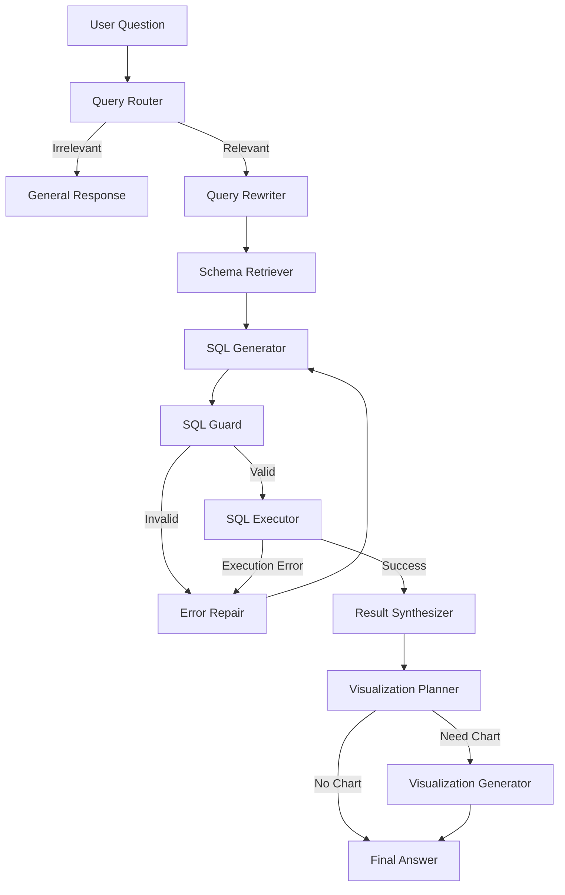

# 本地化数据分析 Agent 项目计划

## 1. 项目定位

项目名称建议：

**Local Data Analyst Agent：本地化数据分析 Agent**

项目目标：

构建一个可以在本地运行的自然语言数据分析系统。用户用中文或英文提出业务问题，Agent 自动理解问题、选择数据库表、生成 SQL、进行安全校验、执行查询、修复错误、总结结果，并在适合时生成图表。

该项目面向 Agent 应用开发岗位，重点展示：

- 本地大模型部署能力
- NL2SQL / Text-to-SQL 能力
- LangGraph Agent 工作流编排
- SQL 安全校验与错误修复
- QLoRA 微调能力
- 数据库、后端 API、前端展示的完整闭环
- 微调前后效果评估

## 2. 推荐技术栈

### 模型与微调

- 基础模型：
  - 首选：`Qwen2.5-Coder-1.5B-Instruct`
  - 进阶：`Qwen2.5-Coder-3B-Instruct`
- 微调方式：QLoRA 4bit
- 微调框架：
  - 入门优先：LLaMA Factory
  - 显存优化：Unsloth
  - 工程化可选：Transformers + PEFT + TRL

### Agent 与后端

- Agent 编排：LangGraph
- 后端框架：FastAPI
- LLM API 适配：OpenAI-compatible API
- 本地推理：
  - 起步：Ollama 或 llama.cpp
  - 后续：vLLM + LoRA adapter

### 数据库与检索

- MVP 数据库：SQLite
- 进阶数据库：PostgreSQL
- SQL 解析与安全校验：sqlglot
- Schema 检索：
  - MVP：直接拼接相关表结构
  - 进阶：FAISS / Chroma / Qdrant

### 前端

- MVP：Streamlit
- 进阶：React + Vite + Tailwind CSS
- 图表：Vega-Lite / ECharts / Plotly

## 3. 核心功能设计

### 3.1 用户自然语言提问

示例问题：

- 最近 7 天销售额是多少？
- 哪个商品品类退款率最高？
- 过去 6 个月每月新增用户趋势如何？
- 客单价最高的前 10 个商品是什么？
- 支付失败率最近是否升高？

### 3.2 Agent 工作流

推荐 LangGraph 节点：

1. Query Router
   - 判断问题是否属于数据库分析范围。

2. Query Rewriter
   - 改写模糊问题，使其更适合 SQL 生成。
   - 例如把“看看最近卖得怎么样”改成“统计最近 7 天每日销售额”。

3. Schema Retriever
   - 检索相关表结构、字段说明、业务指标定义。

4. SQL Generator
   - 根据用户问题和 schema 生成 SQL。
   - 这是最适合接入微调模型的节点。

5. SQL Guard
   - 使用 sqlglot 做 AST 校验。
   - 只允许 SELECT。
   - 禁止 DROP / DELETE / UPDATE / INSERT / ALTER。
   - 禁止多语句。
   - 自动添加 LIMIT。
   - 设置查询超时。

6. SQL Executor
   - 执行 SQL。
   - 返回结构化结果。

7. Error Repair
   - SQL 语法错误、字段不存在、表名错误时，把错误反馈给模型重新生成。

8. Result Synthesizer
   - 将查询结果转换成自然语言分析结论。

9. Visualization Planner
   - 判断是否适合画图。

10. Visualization Generator
   - 生成图表配置。

### 3.3 推荐流程图



## 4. 数据库设计

建议使用电商分析场景，面试官容易理解。

### 核心表

- `users`
  - 用户信息
  - 字段：`id`, `name`, `city`, `created_at`

- `products`
  - 商品信息
  - 字段：`id`, `name`, `category`, `price`

- `orders`
  - 订单主表
  - 字段：`id`, `user_id`, `status`, `total_amount`, `created_at`

- `order_items`
  - 订单明细
  - 字段：`id`, `order_id`, `product_id`, `quantity`, `unit_price`

- `payments`
  - 支付记录
  - 字段：`id`, `order_id`, `payment_method`, `status`, `paid_at`

- `refunds`
  - 退款记录
  - 字段：`id`, `order_id`, `amount`, `reason`, `created_at`

### 可扩展表

- `traffic_events`
- `coupons`
- `reviews`
- `inventory`

## 5. 微调方案

### 5.1 微调目标

微调不是为了让模型记住数据库数据，而是让模型学会：

- 按固定 SQL 方言生成查询
- 理解业务指标口径
- 稳定输出 SQL，不输出解释
- 使用正确表名和字段名
- 生成只读查询
- 遇到模糊问题时倾向于澄清或使用默认业务规则
- 根据数据库错误修复 SQL

### 5.2 数据格式

推荐使用指令数据格式：

```json
{
  "instruction": "根据数据库表结构生成 PostgreSQL 查询语句，只允许 SELECT。",
  "input": "Schema: orders(id, user_id, total_amount, status, created_at)\nQuestion: 查询最近7天已支付订单的总销售额。",
  "output": "SELECT SUM(total_amount) AS total_sales FROM orders WHERE status = 'paid' AND created_at >= CURRENT_DATE - INTERVAL '7 days';"
}
```

如果使用 chat template，可以转换为：

```json
{
  "messages": [
    {
      "role": "user",
      "content": "Schema: orders(id, user_id, total_amount, status, created_at)\nQuestion: 查询最近7天已支付订单的总销售额。"
    },
    {
      "role": "assistant",
      "content": "SELECT SUM(total_amount) AS total_sales FROM orders WHERE status = 'paid' AND created_at >= CURRENT_DATE - INTERVAL '7 days';"
    }
  ]
}
```

### 5.3 数据规模

MVP 阶段：

- 100-300 条训练样本
- 50 条测试样本

简历增强版：

- 800-1500 条训练样本
- 200 条测试样本
- 覆盖聚合、JOIN、时间过滤、排序、分组、退款率、复购率等业务指标

### 5.4 8GB 显存推荐训练参数

- 微调方式：QLoRA 4bit
- 模型：`Qwen2.5-Coder-1.5B-Instruct`
- batch size：1
- gradient accumulation：8 或 16
- max sequence length：512 起步，稳定后试 1024
- LoRA rank：8
- LoRA alpha：16
- optimizer：paged_adamw_8bit
- gradient checkpointing：开启

进阶可尝试：

- `Qwen2.5-Coder-3B-Instruct`
- max sequence length 1024
- LoRA rank 16

## 6. 本地部署路线

### 阶段 1：先跑通应用

使用 Ollama 或 llama.cpp 部署量化模型。

优点：

- 对 8GB 显存更友好
- 启动简单
- 适合本地 demo

### 阶段 2：接入微调 adapter

训练得到 LoRA adapter 后：

- 方案 A：合并 adapter，导出完整模型，再量化部署
- 方案 B：vLLM `--enable-lora` 加载 adapter

8GB 显存下建议先用方案 A 或 Ollama 跑通，后续再尝试 vLLM。

### 阶段 3：OpenAI-compatible API

统一封装为：

```text
POST /v1/chat/completions
```

后端 Agent 不直接依赖某个模型服务，方便在以下服务之间切换：

- OpenAI
- Ollama
- vLLM
- llama.cpp server

## 7. 评估指标

### SQL 质量指标

- Valid SQL Rate
  - 生成 SQL 能否被数据库解析。

- Execution Accuracy
  - SQL 执行结果是否与标准答案一致。

- Exact Match
  - 生成 SQL 是否与参考 SQL 完全一致。
  - 该指标仅作参考，因为等价 SQL 可能写法不同。

- Repair Success Rate
  - 第一次失败后，Agent 自动修复成功的比例。

### 安全指标

- Unsafe SQL Rate
  - 是否生成 DELETE / UPDATE / DROP 等危险语句。

- Guardrail Block Rate
  - SQL Guard 是否能正确拦截危险查询。

### Agent 指标

- End-to-End Success Rate
  - 用户问题到最终答案的完整成功率。

- Tool-call Success Rate
  - schema 检索、SQL 执行、图表生成等工具调用是否成功。

- Latency
  - 端到端响应时间。

### 微调对比

需要做微调前后对比：

- Base model
- Base model + prompt
- Fine-tuned model
- Fine-tuned model + Agent repair

## 8. MVP 开发计划

### 第 1 周：基础应用闭环

目标：

- 搭建 SQLite 电商数据库
- 写入模拟数据
- 实现 FastAPI 后端
- 实现基本 NL2SQL 调用
- 实现 SQL 执行与结果返回

交付物：

- `/chat` API
- 可以问 10-20 个基础业务问题
- 返回 SQL 和查询结果

### 第 2 周：LangGraph Agent 工作流

目标：

- 实现 Query Router
- 实现 Query Rewriter
- 实现 Schema Retriever
- 实现 SQL Generator
- 实现 SQL Guard
- 实现 Error Repair
- 实现 Result Synthesizer

交付物：

- 完整 Agent 状态流
- SQL 错误自动修复
- 只读 SQL 安全限制

### 第 3 周：前端与可视化

目标：

- 实现 Streamlit 或 React 前端
- 展示用户问题、生成 SQL、查询表格、自然语言结论
- 支持简单图表
- 展示 Agent 执行步骤

交付物：

- 可演示 UI
- 支持表格和图表展示

### 第 4 周：QLoRA 微调

目标：

- 准备 300-500 条 Text-to-SQL 数据
- 使用 QLoRA 微调小模型
- 接入微调模型到 SQL Generator
- 做微调前后评估

交付物：

- LoRA adapter
- 微调训练日志
- 评估结果表

### 第 5 周：部署与项目包装

目标：

- 本地模型服务化
- 后端统一 OpenAI-compatible 调用
- 写 README
- 录制演示 GIF 或截图
- 整理简历 bullet

交付物：

- 完整 GitHub 项目
- README
- 架构图
- Demo 截图
- 简历描述

## 9. 项目目录建议

```text
local-data-analysis-agent/
  backend/
    app/
      api/
      agents/
      graph/
      models/
      services/
      tools/
      state/
    data/
    tests/
    requirements.txt
  frontend/
    src/
    package.json
  training/
    data/
    scripts/
    configs/
    outputs/
  eval/
    datasets/
    scripts/
    reports/
  docs/
    architecture.md
    finetuning.md
    evaluation.md
  README.md
```

## 10. 简历表达方向

项目标题：

**本地化数据分析 Agent：QLoRA Text-to-SQL + LangGraph + SQL 安全校验**

简历描述示例：

- 构建本地化数据分析 Agent，支持用户通过自然语言查询业务数据库，系统自动完成 schema 检索、SQL 生成、安全校验、执行、错误修复、结果总结与图表可视化。
- 基于 Qwen2.5-Coder 使用 QLoRA 微调 Text-to-SQL 能力，使模型适配电商业务表结构和指标口径，并对比微调前后 SQL 执行成功率与结果一致率。
- 使用 LangGraph 编排 Query Rewriter、Schema Retriever、SQL Generator、SQL Guard、Executor 和 Synthesizer 等节点，实现可追踪、可重试的 Agent 工作流。
- 设计 SQL Guard 模块，基于 AST 解析限制只读查询、拦截危险 SQL、自动注入 LIMIT，并加入查询超时和错误修复机制。
- 通过 FastAPI 封装后端服务，接入本地模型推理接口，支持 OpenAI-compatible API，前端展示 SQL、查询结果、图表和 Agent 执行过程。

## 11. 风险与取舍

### 8GB 显存限制

风险：

- 3B 模型训练可能 OOM
- vLLM 部署可能显存紧张

解决：

- 先用 1.5B 模型跑通
- 使用 QLoRA
- max sequence length 从 512 开始
- batch size 固定为 1
- 本地部署先用 Ollama 或 llama.cpp

### NL2SQL 准确率不稳定

风险：

- 模型可能选错表
- JOIN 条件可能错
- 指标口径可能错

解决：

- 加 schema retriever
- 加业务指标定义文档
- 加错误修复节点
- 增加评估集
- 微调覆盖典型业务查询

### SQL 安全风险

风险：

- 模型可能生成危险语句

解决：

- 数据库账号只读
- sqlglot AST 校验
- 禁止多语句
- 禁止写操作
- 查询超时
- 返回行数限制

## 12. 最小可行版本

如果只做第一版，建议范围收窄到：

- SQLite 电商数据库
- 50-100 条问题样本
- 基础 NL2SQL
- SQL Guard
- 查询执行
- 中文结果总结
- 简单前端

第一版不必马上做：

- 大规模微调
- vLLM 部署
- 多数据库支持
- 多用户权限
- 复杂图表系统

先把完整闭环跑通，再逐步增强。

